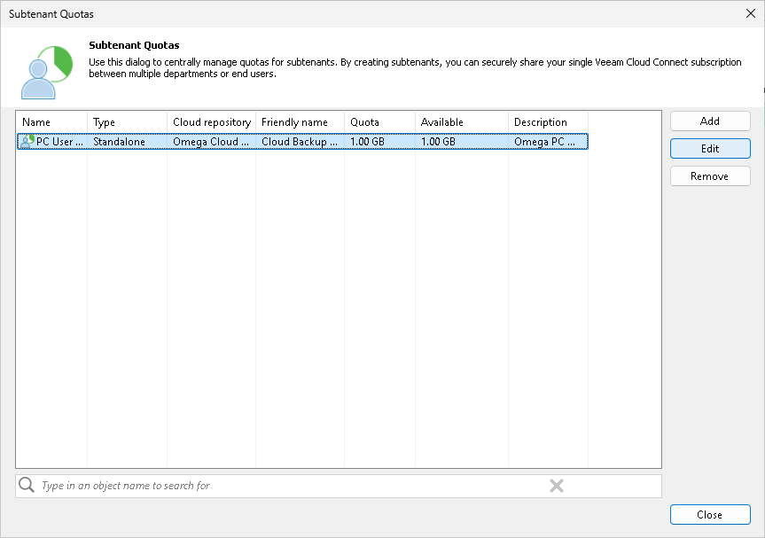

# Editing Subtenant Account

You can edit settings of created subtenant accounts. For example, you may want to reallocate storage quota for the subtenant, change password for the subtenant account of a standalone tenant account, disable or enable the subtenant account.

|  |
| --- |
| Note |
| Consider the following:   * You cannot change a user name for the subtenant account. * The SP cannot change the password for a managed subtenant account. This operation is available only for the tenant in the tenant backup console. |

To edit settings of a subtenant account:

1. Open the Subtenant Quotas window in one of the following ways:

* Open the Cloud Connect view. Click the Tenants node in the inventory pane, select the necessary tenant in the working area and click Manage Subtenants on the ribbon.

* Open the Cloud Connect view. Click the Tenants node in the inventory pane, right-click the necessary tenant in the working area and select Manage subtenants.

1. In the Subtenant Quotas window, select the necessary subtenant account and click Edit.

To quickly find the necessary subtenant account, use the search field at the bottom of the Subtenant Quotas window:

1. Enter the user name of the subtenant account or a part of it in the search field.
2. Click the Start search button on the left or press [ENTER].

1. In the edit subtenant wizard, edit subtenant account settings as required.

