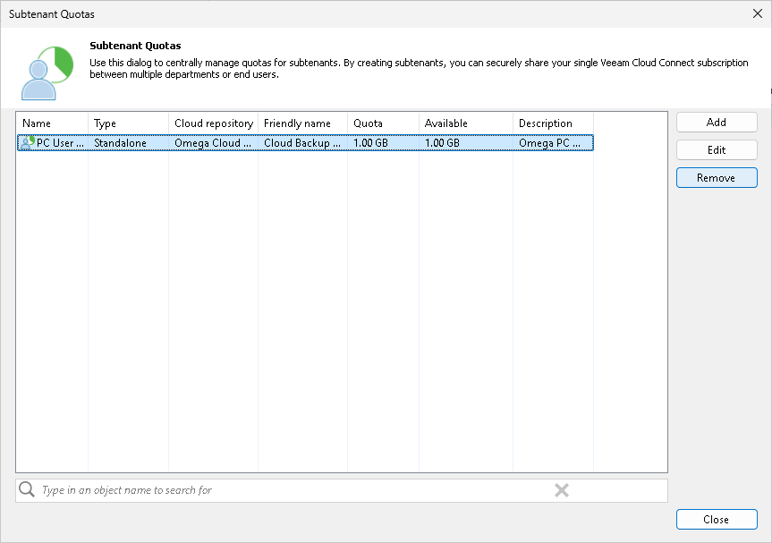

In this article

You can delete a subtenant account that you created at any time, for example, if the subtenant no longer uses resources of the cloud repository.

When you delete a subtenant account, Veeam Backup & Replication disables this account and removes it. The subtenant account is removed permanently. You cannot undo this operation.

Subtenant backup data remain intact on the cloud repository. You can delete subtenant backup data manually later if needed.

|  |
| --- |
| Note |
| You cannot delete managed subtenant accounts — subtenant accounts created automatically by Veeam Backup & Replication in the Veeam Agent management scenario. |

To delete a subtenant account:

1. Open the Subtenant Quotas window in one of the following ways:

* Open the Backup Infrastructure view, click the Backup Repositories node in the inventory pane, select the cloud repository in the working area and click Manage Subtenants on the ribbon.

* Open the Backup Infrastructure view, click the Backup Repositories node in the inventory pane, right-click the cloud repository in the working area and select Manage subtenants.

* Open the Backup Infrastructure view. Click the Service Providers node in the inventory pane, select the service provider in the working area and click Manage Subtenants on the ribbon.

* Open the Backup Infrastructure view, click the Service Providers node in the inventory pane, right-click the service provider in the working area and select Manage subtenants.

1. In the Subtenant Quotas window, select the necessary subtenant account and click Remove.

To quickly find the necessary subtenant account, use the search field at the bottom of the Subtenant Quotas window:

1. Enter the user name of the subtenant account or a part of it in the search field.
2. Click the Start search button on the left or press [ENTER].

Page updated 1/30/2024

Page content applies to build 13.0.1.1071
