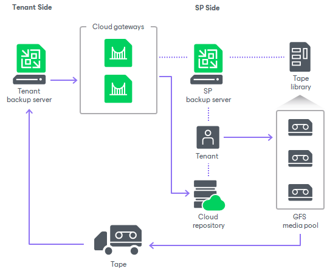

# Tenant Backup to Tape

The SP can write backups created by a tenant in a cloud repository to a tape media. This allows the SP to offer additional tier of data protection to their tenants: the tenant will have one copy of the backed-up data in a cloud repository, and another copy of the backed-up on a tape media on the SP side. In case some important data in the cloud repository becomes unavailable, the tenant can ask the SP to restore the necessary data from tape.

The SP can also use the tenant backup to tape functionality to offer a separate data protection scenario — Tape as a Service. If a tenant is required to keep backups of their data on a tape media, they can request to copy their backups to tape and obtain the tape media from the SP without the need to deploy and maintain their own tape infrastructure.

The ability to archive tenant backups to tape can also help the SP protect their own infrastructure against disasters that may result in loss of tenant data.

Veeam Backup & Replication supports backup to tape for all types of tenant backups: backups created by VM backup jobs, Veeam Agent backup jobs and backup copy jobs that process VM backups and Veeam Agent backups.

All tasks within the tenant backup to tape scenario are performed by the SP. The tenant is unaware of the tape infrastructure deployed on the SP side. The tenant cannot view or manage backup to tape jobs configured by the SP, and perform operations with backups created by these jobs.

Related Topics

* [Getting Started with Tenant Backup to Tape](cloud_connect_tape_quickstart.md)
* [Tenant Backup to Tape Job](cloud_connect_tape_job.md)
* [Data Restore from Tenant Backups on Tape](cloud_connect_tape_restore.md)

Related Tasks

* [Creating Tenant Backup to Tape Job](cc_backup_to_tape_backup.md)
* [Restoring Tenant Data from Tape](cc_backup_to_tape_restore.md)

