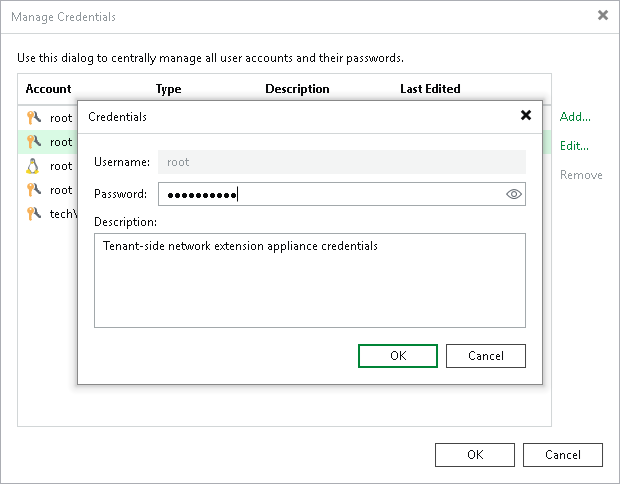

# Managing Credentials

Veeam Backup & Replication connects to the network extension appliance using service credentials — credentials for the root account on the Linux-based network extension appliance VM. You can use these credentials to log on to the network extension appliance VM. This may be useful if you need to configure the network extension appliance manually, for example, for troubleshooting reasons.

It is recommended that you change the password in the service credentials record before connecting to the SP and deploying network extension appliances. You can change the password using the Credentials Manager.

|  |
| --- |
| Note |
| If you change the password after the network extension appliance is deployed, you will need to redeploy the network extension appliance. To learn more, see [Redeploying Network Extension Appliance](cloud_connect_tenant_appliance_redeploy.md). |

To change a password for the root account of network extension appliance VMs:

1. From the main menu, select Credentials and Passwords > Datacenter Credentials.
2. Select the Tenant-side network extension appliance credentials record and click Edit.
3. Veeam Backup & Replication will display a warning notifying that you will need to redeploy existent network extension appliances after you change the password. Click Yes to confirm your intention.
4. In the Password field, enter a password for the root account. To view the entered password, click and hold the eye icon on the right of the Password field.

The specified password will be assigned to the root account of every network extension appliance VM that will be deployed on the source virtualization host.

1. In the Description field, if necessary, change the default description for the edited credentials record.
2. Click OK to save the specified password.

