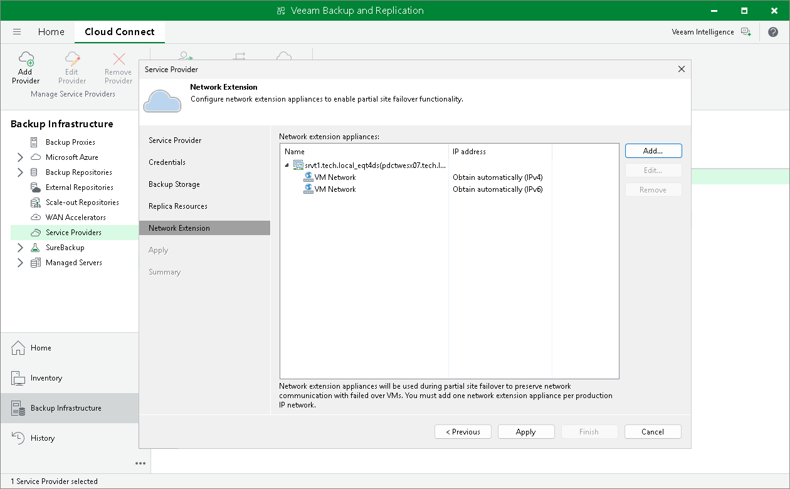

In this article

You can redeploy the network extension appliance on the source host. This may be necessary when the network extension appliance becomes inoperative or when you change the password in the network extension appliance credentials record after one or several appliances are already deployed.

To redeploy the network extension appliance:

1. Open the Backup Infrastructure view.
2. In the inventory pane, click Service Providers.
3. In the working area, right-click the necessary service provider and select Properties.
4. At the Network extension step of the Service Provider wizard, in the Network extension appliances section, select the network extension appliance and click Remove.
5. If you deployed several network extension appliances on the source host and need to redeploy these appliances after changing the password, repeat step 3 for every appliance in the Network extension appliances list.
6. Click Add and configure the new network extension appliance as required. To learn more, see [Configuring Network Extension Appliance](cloud_connect_sp_network_appliance.md#configure).
7. Proceed to the Summary step of the wizard and click Finish to exit the wizard.

Page updated 4/17/2024

Page content applies to build 13.0.1.1071
