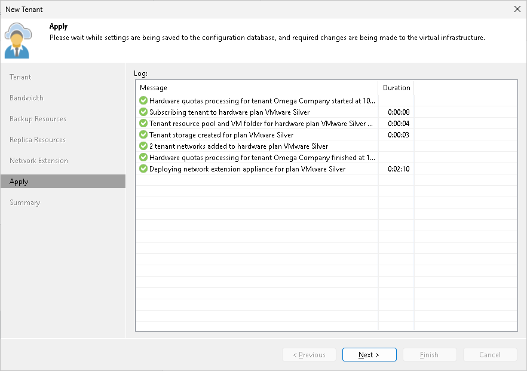

# Step 7. Assess Results

The Apply step is available if you selected the Replication resources option at the Tenant step of the wizard.

At this of the wizard, Veeam Backup & Replication will assign the cloud resources to the tenant. Wait for the required operations to complete and click Next to continue.

