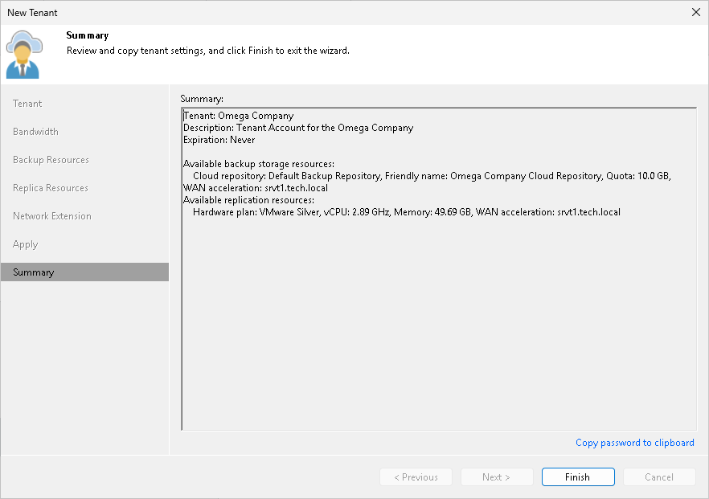

In this article

At the Summary step of the wizard, complete the procedure of tenant account registration.

1. Click the Copy password to clipboard link at the bottom of the wizard window. You must send the copied password to the tenant so that the tenant can connect to the SP using the created tenant account.
2. Review the information about the added tenant account and click Finish to exit the wizard.

Page updated 1/25/2024

Page content applies to build 13.0.1.1071
