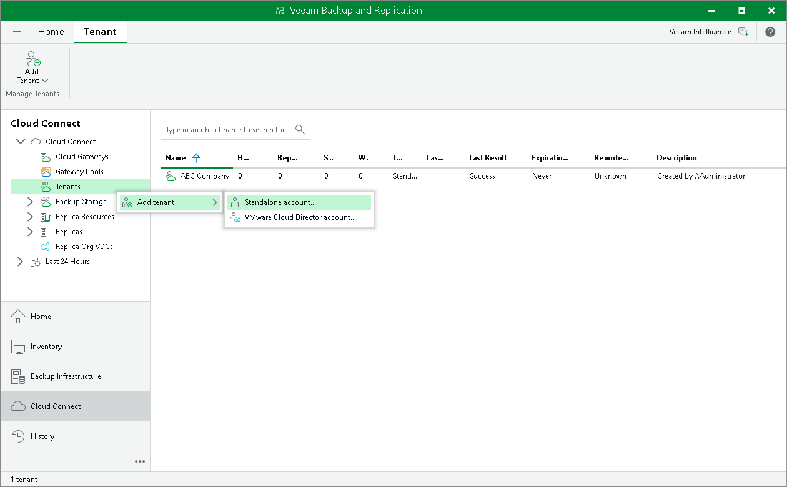

# Step 1. Launch New Tenant Wizard

To launch the New Tenant wizard, do one of the following:

* Open the Cloud Connect view. Click Add Tenant > Standalone account on the ribbon.
* Open the Cloud Connect view. Click the Cloud Connect node in the inventory pane and click the Standalone Account link in the working area.

* Open the Cloud Connect view. Right-click the Cloud Connect node in the inventory pane and select Add tenant > Standalone account.

* Open the Cloud Connect view. Click the Tenants node in the inventory pane and click Add Tenant > Standalone account on the ribbon.
* Open the Cloud Connect view. Right-click the Tenants node in the inventory pane or right-click anywhere in the working area and select Add tenant > Standalone account.

