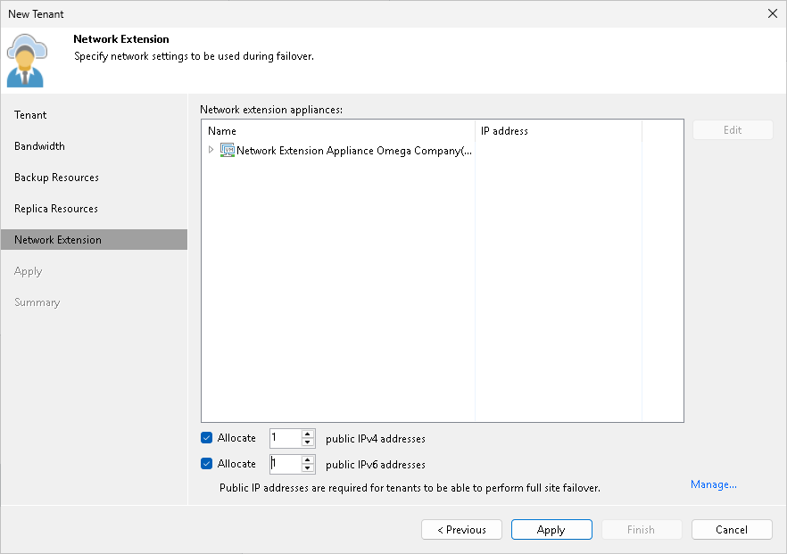
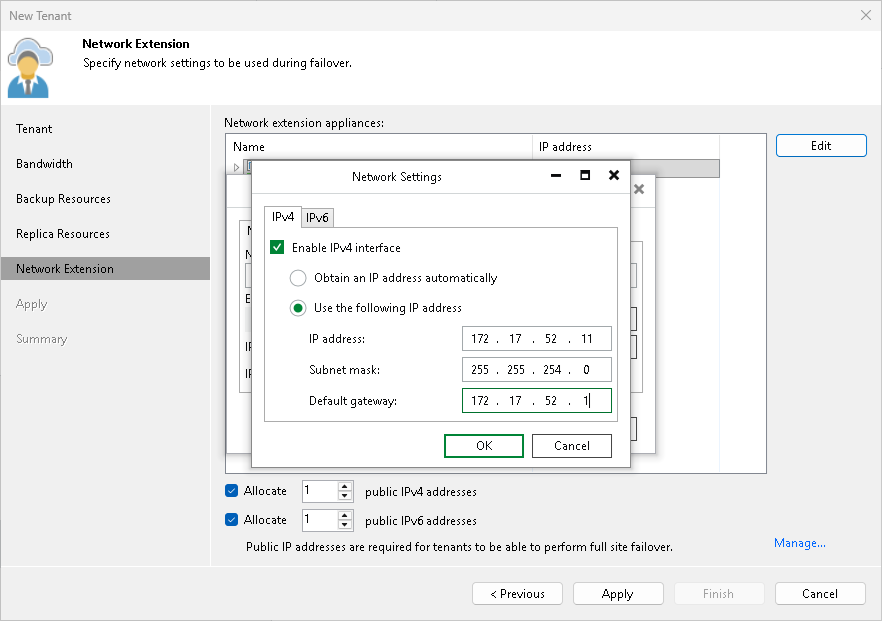

In this article

The Network Extension step of the wizard is available if you selected the Use Veeam network extension capabilities during partial and full site failover option at the [Replica Resources](cloud_connect_user_compute_resources.md) step of the wizard. You can use this step to specify network settings for the network extension appliance that Veeam Backup & Replication will deploy on the SP side.

Veeam Backup & Replication deploys the network extension appliance on the SP virtualization host that provides resources for the hardware plan to which the SP subscribes the tenant. VM replicas on the cloud host use the SP network extension appliance:

* To communicate to VMs in the production site after partial site failover.
* To communicate to the internet after full site failover.

At the Network Extension step of the wizard, the SP configures one network adapter (vNIC) on the network extension appliance. This network adapter connects the network extension appliance to the external network where SP backup infrastructure components reside.

To set up the network extension appliance:

1. Click Edit on the right of the Network extension appliances list.
2. In the Network Settings window, in the Network extension appliance field, check and edit if necessary the name for the network extension appliance.
3. Click the Browse button next to the External network field and select the SP production network to which the SP Veeam Backup & Replication infrastructure components are connected.
4. Specify the IP addressing settings for the configured network extension appliance:

* To assign an IP address automatically in case there is a DHCP server in your network, make sure that the Obtain automatically value is displayed in the IPv4 address and IPv6 address fields.
* To manually assign a specific IP address to the appliance, click Configure and specify network settings for the appliance. For details, see [Specifying Network Settings](#network).

1. Click OK.
2. [Optional] If you have not reserved in advance the necessary number of public IP addresses that can be assigned to VM replicas, click the Manage link to add one or several IP addresses to the pool of available public IP addresses. To learn more, see [Managing Public IP Addresses](cloud_connect_user_public_ip.md).
3. Select the Allocate <N> public IPv4 addresses option and specify the number of public IPv4 addresses to provide VM replicas with the ability to be accessed from the internet after full site failover. Veeam Backup & Replication will automatically assign to the tenant the specified number of IPv4 addresses from the reserved pool. A tenant will be able to map an available public IPv4 address to a VM replica at the process of the cloud failover plan configuration. To learn more, see [Specify Public IP Addressing Rules](cloud_failover_plan_public_ip.md).
4. Select the Allocate <N> public IPv6 addresses option and specify the number of public IPv6 addresses to provide VM replicas with the ability to be accessed from the internet after full site failover. Veeam Backup & Replication will automatically assign to the tenant the specified number of IPv6 addresses from the reserved pool. A tenant will be able to map an available public IPv6 address to a VM replica at the process of the cloud failover plan configuration. To learn more, see [Specify Public IP Addressing Rules](cloud_failover_plan_public_ip.md).

Specifying Network Settings

To specify network settings for the network extension appliance:

1. In the Network Settings window, click Configure.
2. To manually assign a specific IPv4 address to the appliance, do the following:

1. On the IPv4 tab, make sure that the Enable IPv4 interface check box is selected.
2. Select the Use the following IP address option and specify the following network settings:

* IP address
* Subnet mask
* Default gateway

Alternatively, if you want to assign an IPv4 address automatically, make sure that the Obtain an IP address automatically option is selected on the IPv4 tab.

If you do not want the network extension appliance to use an IPv4 address, clear the Enable IPv4 interface check box.

1. If you want to assign an IPv6 address to the appliance, do the following:

1. Click the IPv6 tab.
2. Make sure that the Enable IPv6 interface check box is selected.
3. Select the Use the following IP address option and specify the following network settings:

* IP address
* Subnet mask (prefix length)
* Default gateway

Alternatively, if you want to assign an IPv6 address automatically, make sure that the Obtain an IP address automatically option is selected on the IPv6 tab.

If you do not want the network extension appliance to use an IPv6 address, clear the Enable IPv6 interface check box.

1. Click OK.

Page updated 11/9/2023

Page content applies to build 13.0.1.1071
