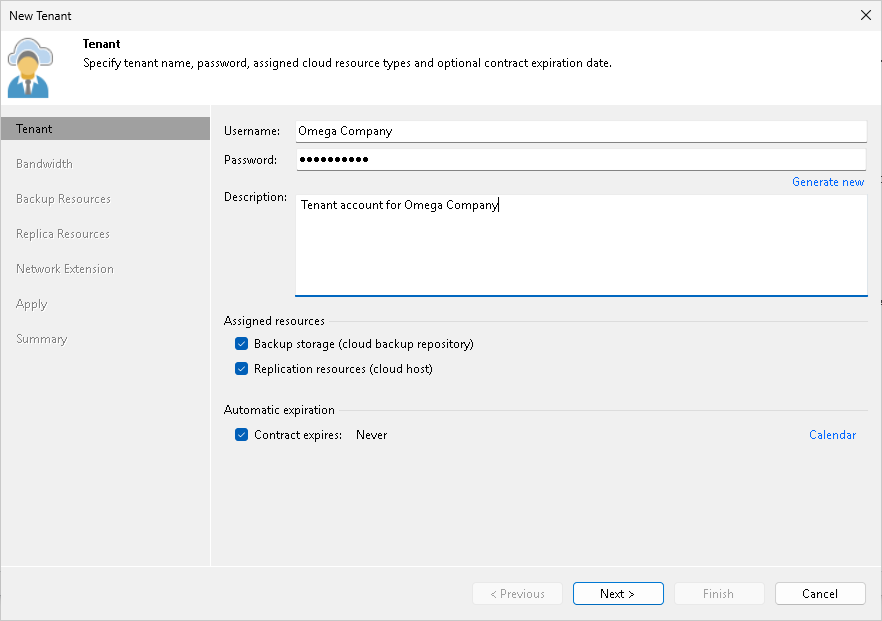

In this article

At the Tenant step of the wizard, specify tenant account and lease settings for the tenant. Lease settings apply to all quotas and hardware plans assigned to the tenant.

1. In the Username field, specify a name for the created tenant account. The user name must meet the following requirements:

* The maximum length of the user name is 128 characters. It is recommended that you create short user names to avoid problems with long paths to backup files on the cloud repository.
* The user name may contain space characters.
* The user name must not contain the following characters: +][,\/:\*?\"<>|=;@ as well as ASCII symbols.
* The user name must not end with the period character [.].

1. In the Password field, provide the password for the tenant account. You can enter your own password or click the Generate new link at the bottom of the field. In the latter case, Veeam Backup & Replication will generate a safe password. You will be able to get a copy the generated password at the last step of the wizard.
2. In the Description field, specify a description for the created tenant account. The default description contains information about the user who created the account, date and time when the account was created.
3. In the Assigned resources section, select what types of Veeam Cloud Connect resources you want to provide to the tenant:

* Backup storage — Cloud Connect Backup resources. With this option enabled, the New Tenant wizard will include an additional Backup Resources step. At the Backup Resources step of the wizard, you can assign a quota on the cloud repository to the tenant. To learn more, see [Allocate Backup Resources](cloud_connect_user_resources.md).
* Replication resources — Cloud Connect Replication resources. With this option enabled, the New Tenant wizard will include an additional Replica Resources step. At the Replica Resources step of the wizard, you can subscribe the tenant to a hardware plan. To learn more, see [Allocate Replication Resources](cloud_connect_user_compute_resources.md).

1. To specify lease settings for the tenant account, select the Contract expires check box and click the Calendar link. In the Select expiration date window, select a date when the lease period must terminate.

If you do not select the Contract expires option, the tenant will be able to use Veeam Cloud Connect resources for an indefinite period of time.

Page updated 4/10/2024

Page content applies to build 13.0.1.1071
