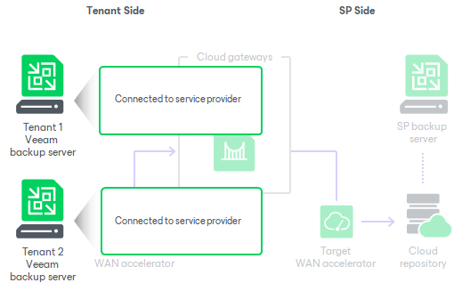

In this article

To work with Veeam Cloud Connect backup and replication resources, the tenant must deploy the Veeam backup server on the tenant side.

The Veeam backup server on the tenant side is a client machine. The tenant who plans to store VM data in the cloud must connect to the SP using Veeam Backup & Replication. When the tenant connects to the SP, cloud repository and cloud replication resources configured on the SP side become visible in the tenant backup infrastructure. The tenant can create necessary jobs, target them at the cloud repository and cloud host and run these jobs to protect tenant VMs.

All data protection and disaster recovery tasks targeted at the cloud repository are performed by tenants themselves. The SP only sets up the Veeam Cloud Connect infrastructure and exposes storage resources on the cloud repository to tenants.

Some disaster recovery tasks with cloud host can be performed not only by tenants but also by the SP. To learn more, see [SP and Tenant Roles](cloud_roles.md).

Related Tasks

[Deploying Tenant Veeam Backup Server](cloud_connect_user_vbr_deploy.md)

Page updated 7/25/2023

Page content applies to build 13.0.1.1071
