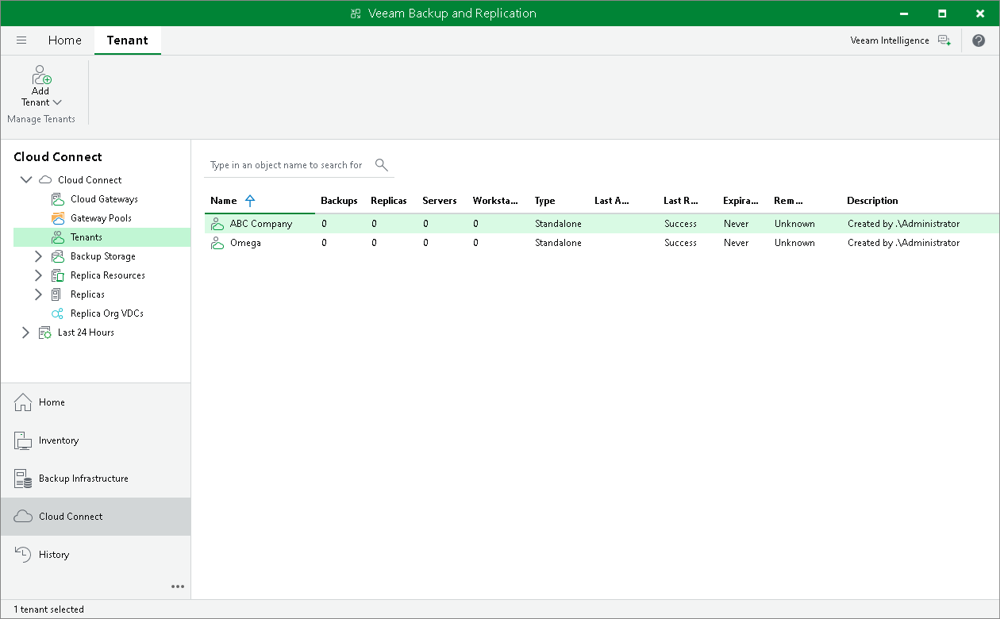

In this article

The SP can view information about registered tenant accounts in the Veeam backup console.

To view information about tenant accounts:

1. Open the Cloud Connect view.
2. In the inventory pane, click the Tenants node.
3. In the working area, view information about tenant accounts. For each tenant account, Veeam Backup & Replication displays information in the following columns:

* Name — name of the tenant account.
* Type — type of the tenant account: Standalone or VMware Cloud Director.
* Backup Count — number of VMs that have backups created by tenant backup jobs.

|  |
| --- |
| Note |
| If you use the Tenants node to track SP resource consumption by tenant workloads, make sure to read [Considerations for Resource Consumption by Tenant Machines](#machine_count). |

* Replica Count — number of VMs that have replicas created by tenant replication jobs.
* Server Count — number of servers that have backups created by tenant Veeam Agent backup jobs. A server is a machine processed with the Server edition of Veeam Agent.
* Workstation Count — number of workstations that have backups created by tenant Veeam Agent backup jobs. A workstation is a machine processed with the Workstation edition of Veeam Agent.
* Remote Management — information about whether the SP can establish a remote connection to the tenant backup server. The tenant backup server is available for remote management if the tenant selected the Allow this Veeam Backup & Replication installation to be managed by the service provider check box when adding the SP in the tenant backup console.
* Description — description for the tenant account.
* Last Active — time since the latest backup job session, replication job session or restore session was completed.
* Last Result — information about the result of the latest session: Success, Warning or Failed.
* Expiration Date — date and time when the lease period expires for the tenant. If you did not enable the Contract expires option in the properties of the tenant account, the Never value is displayed in this column.

Considerations for Resource Consumption by Tenant Machines

You can use the Tenants node of the SP backup console to view information about the number of tenant machines whose backups and replicas consume resources in the SP infrastructure. For this scenario, consider the following:

* The Tenants node displays information about all tenant machines that currently consume resources in the SP Veeam Cloud Connect infrastructure, including rental machines and new workloads. To learn more, see [Rental Machines Licensing](cloud_connect_rental_lic.md) and [New Workloads](cloud_connect_sp_license.md#new_vms).

* The number of machines that consume resources in the SP Veeam Cloud Connect infrastructure may differ from the number of protected workloads that consume the Veeam Cloud Connect license on the SP backup server. The SP must not use information displayed in the Tenants node to report license usage to Veeam. To learn about how to view information about protected tenant workloads, see [Tenant Machine Count](cloud_connect_machine_count.md).

* If the tenant processes the same VM with multiple jobs targeted at different quotas (cloud repositories or cloud hosts), this VM is counted as multiple VMs in the SP backup console. This lets the SP monitor consumption of backup and replication resources in the Veeam Cloud Connect infrastructure — the machine count reflects the number of machines that actually consume tenant quotas. In contrast, in the SP Veeam Cloud Connect license and license usage reports, such a VM is considered as 1 VM and uses the number of instances required to process 1 VM.

For example, the tenant processes 1 VM with 2 backup jobs and 3 replication jobs. In the Tenants node of the Cloud Connect view in the SP backup console, Veeam Backup & Replication will display 2 VMs in the Backup Count column and 3 VMs in the Replica Count column. In the License Information window, Veeam Backup & Replication will display the number of used instances required to process 1 Veeam Cloud Connect Backup VM and 1 Veeam Cloud Connect Replica VM.

Page updated 9/17/2025

Page content applies to build 13.0.1.1071
