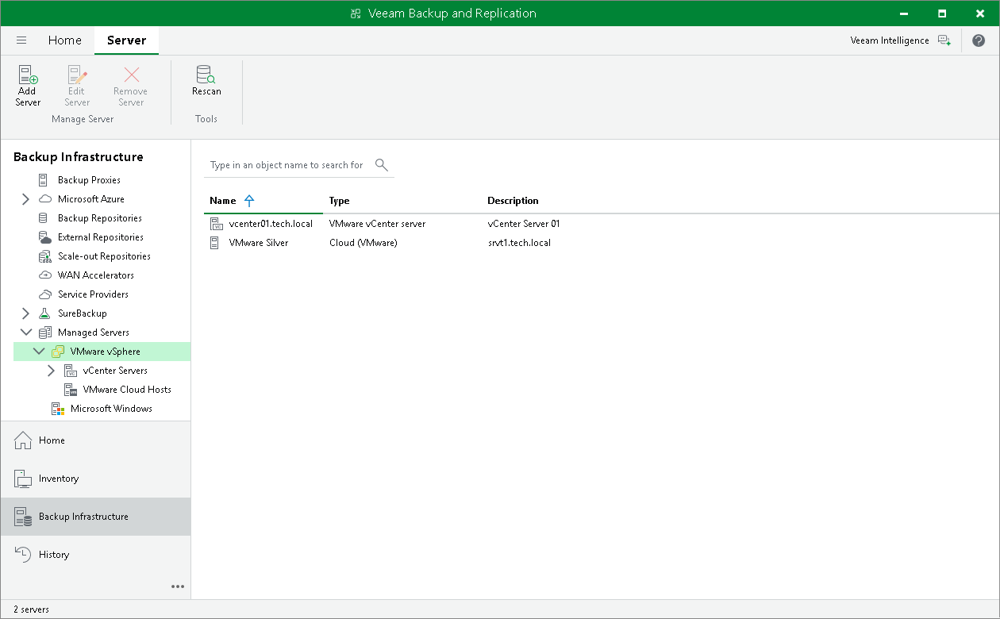

In this article

After tenant connects to the SP, cloud hosts provided to the tenant appear in the tenant Veeam backup console.

To view the available cloud hosts:

1. Open the Backup Infrastructure view.
2. In the inventory panel, expand the Managed Servers node.

* Cloud hosts provided to the tenant through a VMware vSphere hardware plan are displayed under the VMware vSphere > VMware Cloud Hosts node.
* Cloud hosts provided to the tenant through a Microsoft Hyper-V hardware plan are displayed under the Microsoft Hyper-V > Hyper-V Cloud Hosts node.
* Cloud hosts provided to the tenant through a VMware Cloud Director organization VDC are displayed under the VMware Cloud Director > VMware Cloud Director Cloud Hosts node.

If the tenant has set up the Veeam Cloud Connect Replication infrastructure, they can configure replication jobs targeted at the cloud host.

If the SP and tenant have set up the CDP infrastructure, the tenant can configure CDP policies targeted at a VMware vSphere cloud host or VMware Cloud Director cloud host.

Page updated 4/17/2024

Page content applies to build 13.0.1.1071
