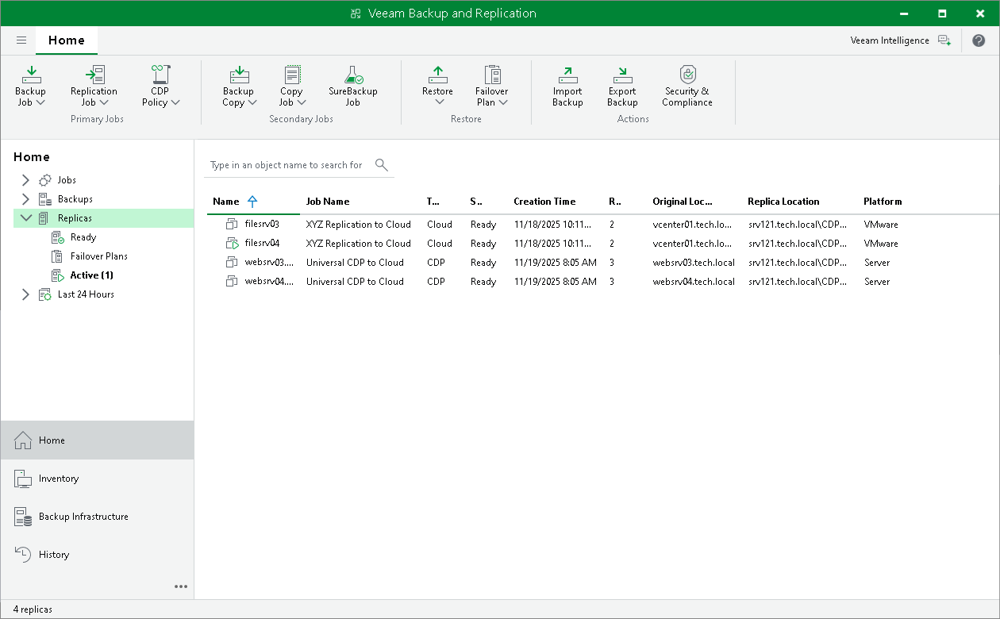

# Viewing Replicas and Failover Plans

After replication job targeted at the cloud host or a cloud failover operation completes, it takes some time for Veeam Backup & Replication to retrieve changes from the database and display those changes in the Veeam Backup & Replication console on the tenant side. For example, when you perform a failover operation, VM replicas and cloud failover plans may be not displayed or displayed with a wrong status.

To refresh the view in the Veeam Backup & Replication console:

1. Open the Home view.
2. Expand the Replicas node and press [F5] to refresh the view.

