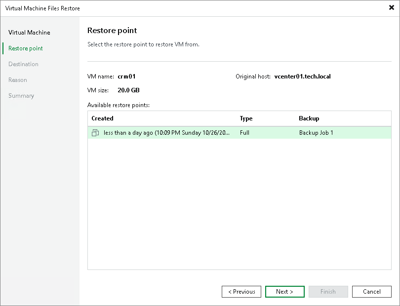
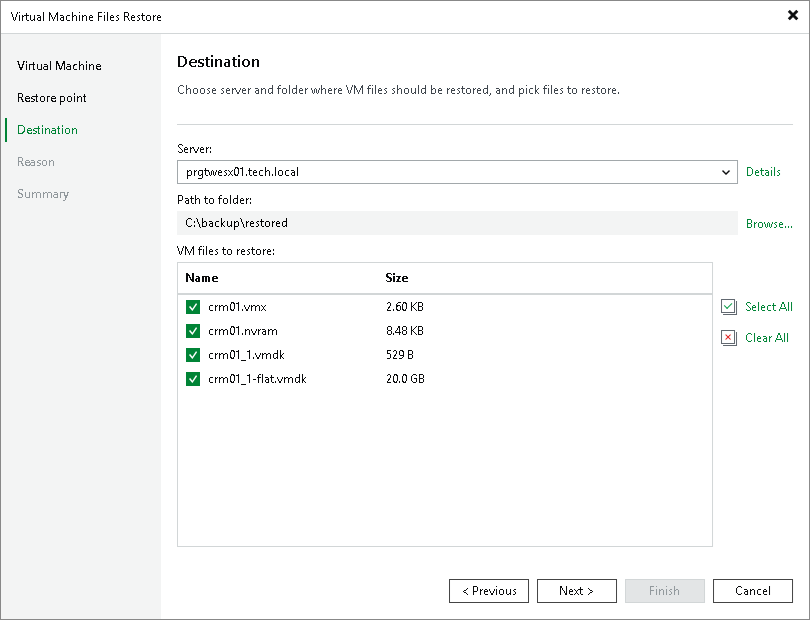

In this article

You can restore specific VM files from the backup: VMDK, VMX and others (for VMware VMs) and VHD/VHDX, XML and others for Microsoft Hyper-V VMs. This scenario can be used, for example, if one of your VM files is missing or is corrupted and you need to bring it back.

VM files can be recovered to the latest state or to any good to know point in time. You can restore them to the original location or to a new location.

|  |
| --- |
| Note |
| This section describes only basic steps that you must take to restore VM files. To get a detailed description of all settings of the restore process, see the [Restoring VM Files](https://helpcenter.veeam.com/docs/vbr/userguide/performing_vmfile_restore.html?ver=13) section in the Veeam Backup & Replication User Guide. |

To restore VM files:

1. Open the Home view.
2. Select the Backups node in the inventory pane. Expand the backup job in the working area, right-click the necessary VM in the backup job and select Restore VM files.
3. At the Restore Point step of the wizard, select the necessary restore point.

1. At the Destination step of the wizard, select the server to which you want to restore the VM files.
2. Specify a path to a folder on the selected host where VM files must be restored, for example: C:\backup\restored.
3. In the VM files to restore section, select a check box next to the necessary VM files.

1. At the Reason step of the wizard, specify the reason for future reference and click Next.
2. At the Summary step of the wizard, click Finish to restore the VM files.

Page updated 11/11/2025

Page content applies to build 13.0.1.1071
