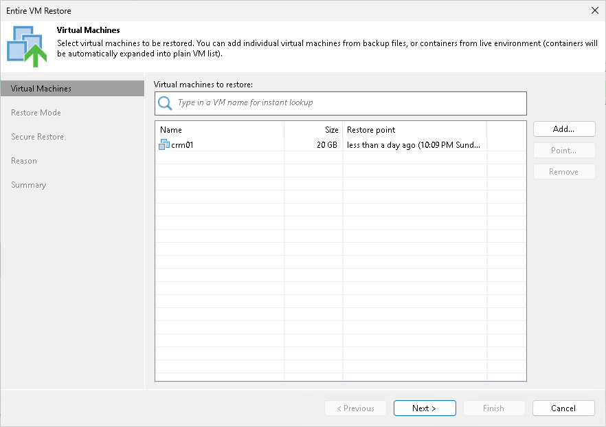
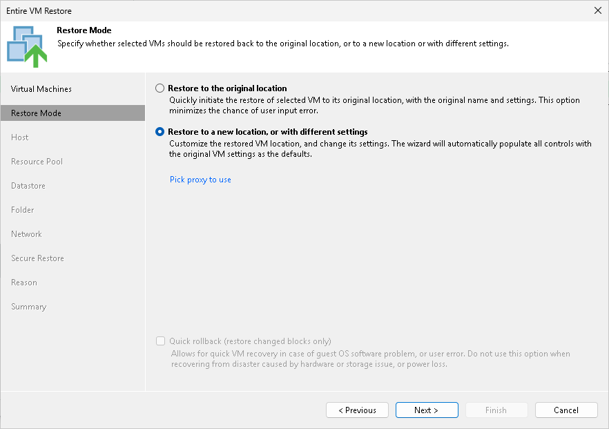
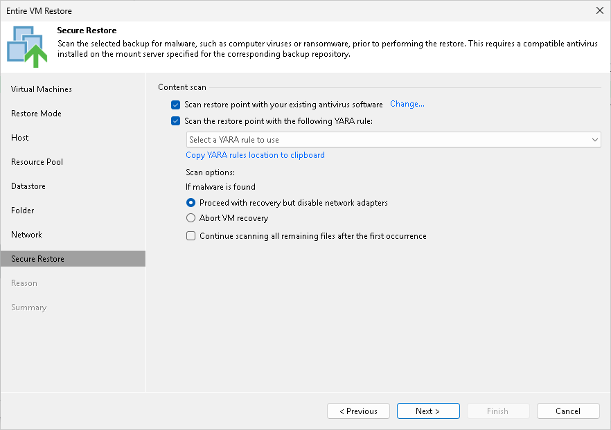
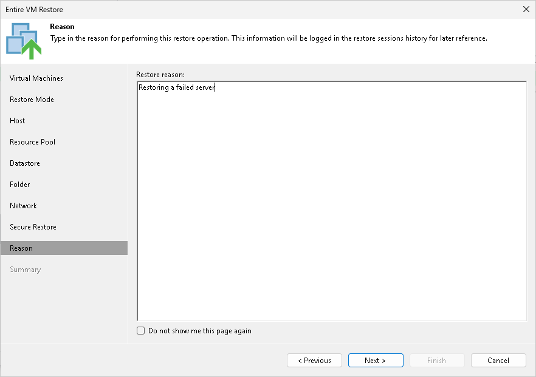

In this article

You can restore one VM or several VMs from the backup, both to the original location or to a new location. A VM can be recovered to the latest state or to any good to know point in time.

|  |
| --- |
| Note |
| This section describes only basic steps that you must take to restore the VM. To get a detailed description of all settings of the restore process, see the [Restoring Entire VMs Using Console](https://helpcenter.veeam.com/docs/vbr/userguide/performing_full_recovery.html?ver=13) section in the Veeam Backup & Replication User Guide. |

To restore one or several VMs from the backup:

1. Open the Home view.
2. Select the Backups node in the inventory pane. Expand the backup job in the working area, right-click the necessary VM in the backup job and select Restore entire VM.
3. At the Virtual Machines step of the wizard, select the VM in the list, click Point on the right and select the necessary restore point.

1. At the Restore Mode step of the wizard, choose to restore the VM to its original location or to a new location.
2. [For VM restore to the original location] Select the Quick rollback check box if you want to use incremental restore for the VM. Veeam Backup & Replication will query CBT to get data blocks that are necessary to revert the VM to an earlier point in time, and will restore only these data blocks from the backup. Incremental restore significantly reduces the restore time and has little impact on the production environment.

1. If you have selected to restore the VM to another location, at the next steps of the wizard, define the host, resource pool, datastore and folder to which the VM must be restored and specify to which networks the VM must be connected.
2. If you want to scan VM data with antivirus software before restoring the VM to the production environment, at the Secure Restore step of the wizard, specify secure restore settings.

You can instruct Veeam Backup & Replication to scan machine data with YARA rules before restoring the machine to the production environment.

For details on secure restore settings for this operation, see the [Specify Secure Restore Settings](https://helpcenter.veeam.com/docs/vbr/userguide/full_restore_av_vm.html?ver=13) section in the Veeam Backup & Replication User Guide.

1. At the Reason step of the wizard, specify the reason for restoring the VM.

1. At the Summary step of the wizard, select the Power on target VM after restoring check box if necessary.
2. Click Finish.

Page updated 11/11/2025

Page content applies to build 13.0.1.1071
