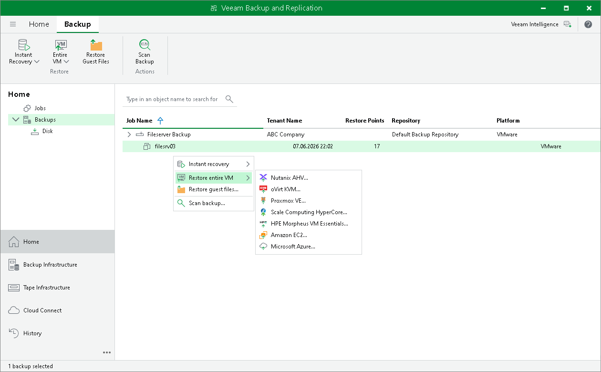

# Performing Entire VM Restore from Tenant Backups

The SP can restore machines from tenant backups stored in a cloud repository.

Veeam Cloud Connect supports entire VM restore from tenant backups stored in a cloud repository to the the following virtualization platforms:

* Restoring to Nutanix AHV
* Restoring to Proxmox VE
* Restoring to oVirt KVM
* Restoring to Scale Computing HyperCore
* Restoring to HPE Morpheus VM Essentials

The SP can also restore machines from tenant backups stored in a cloud repository to the following public cloud environments:

* Restoring to Amazon EC2
* Restoring to Microsoft Azure

The SP can restore one VM or several VMs from the backup. A VM can be recovered to the latest state or to any valid restore point.

To restore a VM from the backup, do the following:

1. Open the Home view.
2. Select the Backups node in the inventory pane.
3. Expand the backup job in the working area, select Entire VM on the ribbon or right-click the necessary VM in the backup job and select Restore entire VM. Then select the target platform.
4. Follow the procedure steps described in the user guide.

[For virtualization platforms] The operation does not differ from the same scenario in the regular Veeam Backup & Replication infrastructure. For details, see the following sections in the Veeam Backup & Replication User Guide:

* [Restoring to Nutanix AHV](https://helpcenter.veeam.com/docs/vbr/userguide/ahv_restore_to_ahv.html?ver=13)
* [Restoring to Proxmox VE](https://helpcenter.veeam.com/docs/vbr/userguide/pve_restore_entire_vm.html?ver=13)
* [Restoring to oVirt KVM](https://helpcenter.veeam.com/docs/vbr/userguide/ovirt_restore_to_rhv.html?ver=13)
* [Restoring to Scale Computing HyperCore](https://helpcenter.veeam.com/docs/vbr/userguide/sch_restore_entire_vm.html?ver=13)
* [Restoring to HPE Morpheus VM Essentials](https://helpcenter.veeam.com/docs/vbr/userguide/hpe_restore_entire_vm.html?ver=13)

[For public cloud environments] For details, see the following sections of this user guide:

* [Restoring to Amazon EC2](cc_restore_aws.md)
* [Restoring to Microsoft Azure](cc_restore_azure.md)

Page updated 2026-06-24

