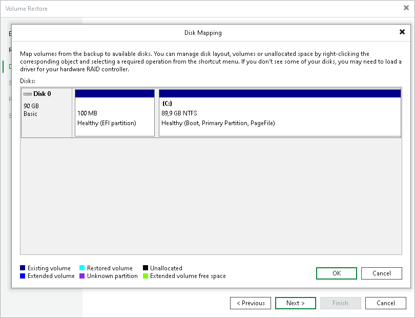
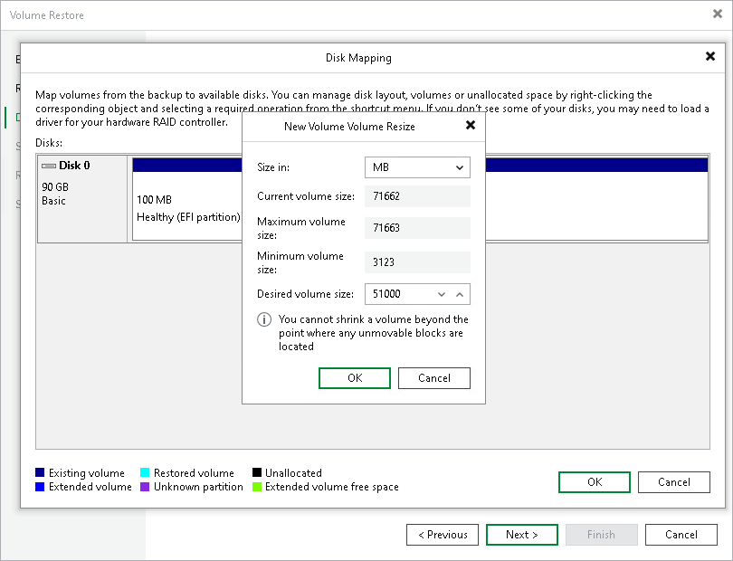
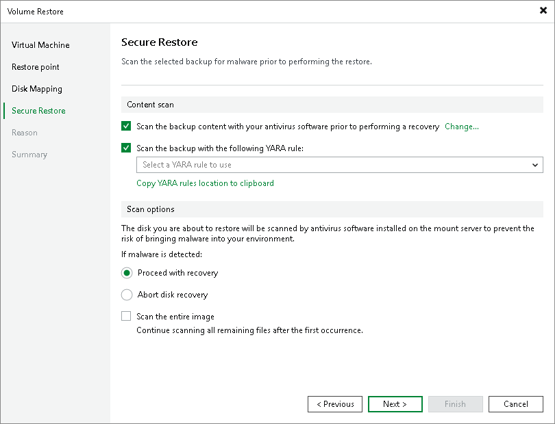

In this article

You can use Veeam Backup & Replication to restore a specific computer volume or all volumes from a volume-level backup created with Veeam Agent for Microsoft Windows.

A volume can be restored to its original location or a new location. If you restore the volume to its original location, Veeam Backup & Replication overwrites data on the original volume. If you restore the volume to a new location, and the target disk contains any data, Veeam Backup & Replication overwrites data in the target location with data retrieved from the backup.

|  |
| --- |
| Note |
| This section describes only basic steps that you must take to restore volumes from a Veeam Agent backup. To get a detailed description of all settings of the volume restore process, see the [Restoring Volumes](https://helpcenter.veeam.com/docs/vbr/userguide/integration_volume_restore.html?ver=13) section in the Veeam Backup & Replication User Guide. |

To restore volumes from a Veeam Agent backup:

1. Open the Home view.
2. Select the Backups node in the inventory pane. Expand the Agents node in the working area, right-click the necessary Veeam Agent backup and select Volume restore.
3. At the Restore Point step of the wizard, select the necessary restore point.

1. At the Disk Mapping step of the wizard, select what volumes you want to restore and map volumes from the backup to volumes on the target computer:

1. Click Choose next to the Destination hosts field and select the target machine where you want to restore volumes. You can restore volumes only to machines that are added to the Veeam Backup & Replication inventory and run Veeam Agent for Microsoft Windows operating in the managed mode. To learn more, see the [Creating Protection Groups](https://helpcenter.veeam.com/docs/vbr/userguide/protection_group_add.html?ver=13) section in the Veeam Backup & Replication User Guide.
2. In the Disk mapping section, select check boxes next to volumes that you want to restore from the backup. By default, Veeam Backup & Replication restores volumes to their initial location and maps the restored volumes automatically. If the initial location is unavailable, Veeam Backup & Replication offers to map volumes manually. You can also map volumes manually, for example, if you want to map the restored volume to another computer disk. To do this, at the bottom of the window click the Customize disk mapping link.
3. In the Disk Mapping window, specify how volumes must be restored. To do this, right-click the target disk on the left and select the necessary disk layout:

* Apply Backup Layout — select this option if you want to apply to disk the settings that were used on your computer at the moment when you performed backup.

* Apply Disk Layout — select this option if you want to apply to the current disk settings of another disk.
* Erase — select this option if you want to discard the current disk settings.

Alternatively, you can right-click unallocated disk space in the disk area on the right and select what volume from the backup you want to place on this computer disk.

If you want to change disk layout configured by Veeam Backup & Replication, right-click an automatically mapped volume and select Remove. You will be able to use the released space for mapping volumes in your own order.

1. At the Disk Mapping step of the wizard, you can set the necessary size for the restored volumes. To do this, right-click the volume in the Disk Mapping window and select Resize. In the Volume Resize window, select the volume size unit and specify the desired size for the restored volume.

1. If you want to scan restored volume data with antivirus software before restoring volumes to the production environment, at the Secure Restore step of the wizard, specify secure restore settings.

* To use antivirus software as a scan engine, select the Scan the restore point with an antivirus engine check box. For more information on antivirus scan, see [Secure Restore](https://helpcenter.veeam.com/docs/backup/vsphere/av_scan_about.html?ver=120).
* You can instruct Veeam Backup & Replication to scan machine data with YARA rules before restoring the machine to the production environment. For a YARA rule to appear in the drop-down list, it must be placed in the YaraRules folder in the Veeam Backup & Replication product folder. The default path is C:\Program Files\Veeam\Backup and Replication\Backup\YaraRules. For more information on how to create a YARA rule, see [YARA Documentation](https://yara.readthedocs.io/en/stable/writingrules.html).

|  |
| --- |
| Tip |
| To copy the path to the folder with YARA rules, click Copy YARA rules location to clipboard. |

* Select the Continue scanning all remaining files after the first occurrence (Scan the entire image – for version Veeam Backup & Replication 12.1 (build 12.1.0.2131) or later) check box if you want to continue the virtual disk scan after a virus threat is detected. For information on how to view results of the malware scan, see the [Viewing Antivirus Scan Results](https://helpcenter.veeam.com/docs/vbr/userguide/av_scan_log.html?ver=13) section in the Veeam Backup & Replication User Guide.

1. At the Reason step of the wizard, enter a reason for restoring computer volumes.
2. At the Summary step of the wizard, click Finish.

Page updated 11/14/2025

Page content applies to build 13.0.1.1071
