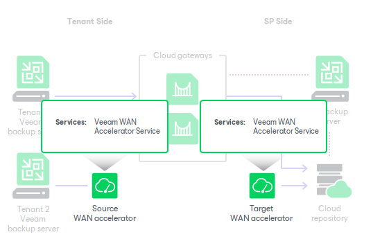

# WAN Accelerators

WAN accelerators are optional components in the Veeam Cloud Connect infrastructure. Tenants may use WAN accelerators:

* For backup copy jobs targeted at the cloud repository
* For replication jobs targeted at cloud hosts

WAN accelerators in the Veeam Cloud Connect infrastructure run the same services and perform the same role as WAN accelerators in a regular backup infrastructure. When configuring backup copy or replication jobs, tenants can choose to exchange data over a direct channel or communicate with the cloud repository or cloud host through WAN accelerators. To pass VM data through WAN accelerators, the SP and tenants must configure WAN accelerators in the following way:

* The source WAN accelerator is configured on the tenant side.
* The target WAN accelerator is configured on the SP side.

The SP can configure several target WAN accelerators and assign them to different tenants. Each target WAN accelerator is strictly associated with the tenant quota on the cloud repository and the hardware plan to which the tenant is subscribed (cloud host). This way, tenant data always go through the assigned target WAN accelerator and Veeam Backup & Replication can use the global cache on the target WAN accelerator more efficiently.

Tenants do not know about target WAN accelerators on the SP side: they can only see whether Veeam Cloud Connect resources can use WAN acceleration or not. When tenants create backup copy or replication jobs that transfer data through WAN accelerators, they define only the source WAN accelerator in the job properties. The target WAN accelerator is not selected. During the backup copy or replication job, the Veeam Cloud Connect Service on the SP Veeam backup server automatically assigns the necessary target WAN accelerator on the SP side for the job.

Limitations for WAN Accelerators in Veeam Cloud Connect Infrastructure

Veeam Backup & Replication does not use tenant backups to populate global cache on the service provider side. For more information about global cache population, see the [Manual Population of Global Cache](https://helpcenter.veeam.com/docs/vbr/userguide/wan_population.html?ver=13) section in the Veeam Backup & Replication User Guide.

