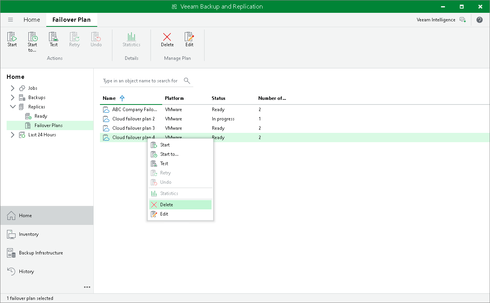

# Deleting Cloud Failover Plan

You can delete a cloud failover plan, for example, if you do not plan to use it any longer.

To delete a cloud failover plan:

1. Open the Home view.
2. In the inventory pane, expand the Replicas node and click Failover Plans.
3. In the working area, right-click the necessary cloud failover plan and select Delete.
4. In the displayed window, click Yes to confirm the operation.

