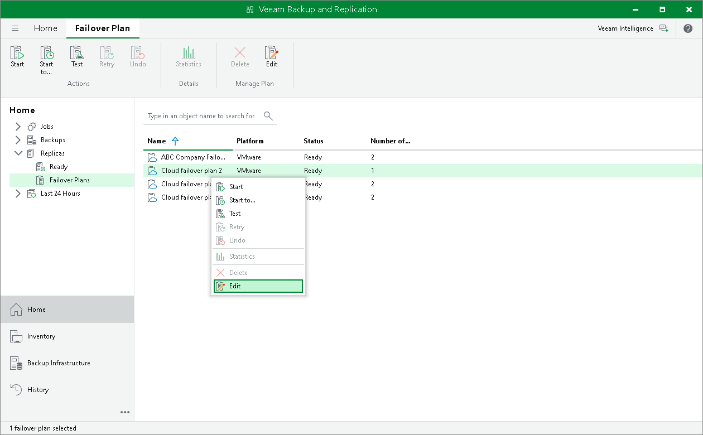

# Editing Cloud Failover Plan Settings

You can edit settings of cloud failover plans that you configured.

To edit cloud failover plan settings:

1. Launch the Edit Cloud Failover Plan wizard:

1. Open the Home view and click Replicas > Failover Plans in the inventory pane.
2. In the working area, click the necessary cloud failover plan and click Edit on the ribbon or right-click the necessary cloud failover plan and select Edit.

1. Edit cloud failover plan settings as required.

