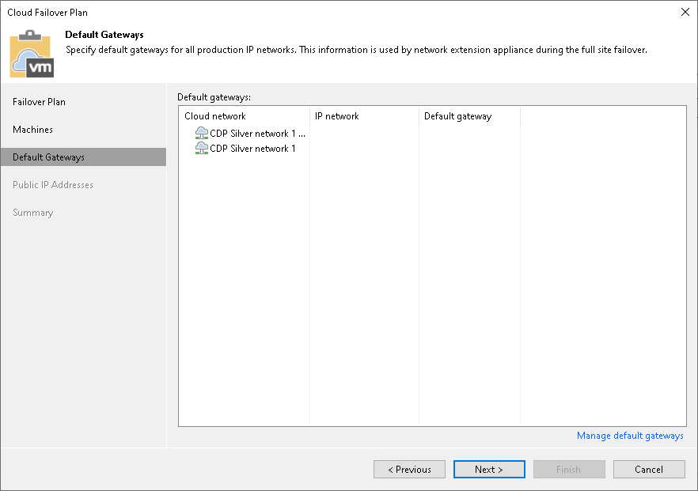

In this article

At the Default Gateways step of the wizard, check and, if necessary, specify default gateways in every IP network in the production site that are used by VMs added to the cloud failover plan. The network extension appliance on the cloud host will use network settings of the specified gateways to route traffic between VM replica networks and external networks after full site failover.

Veeam Backup & Replication automatically specifies default gateways in detected production networks during the first run of the replication job targeted at the cloud host. If, for some reason, the list of default gateways at the Default Gateways step of the wizard is empty, you should specify default gateways manually.

To specify default gateways, click Manage default gateways at the bottom of the Cloud Failover Plan wizard window. Then use the Default Gateways window to specify default gateway settings. To learn more, see [Managing Default Gateways](cloud_connect_default_gateways.md).

Page updated 1/25/2024

Page content applies to build 13.0.1.1071
