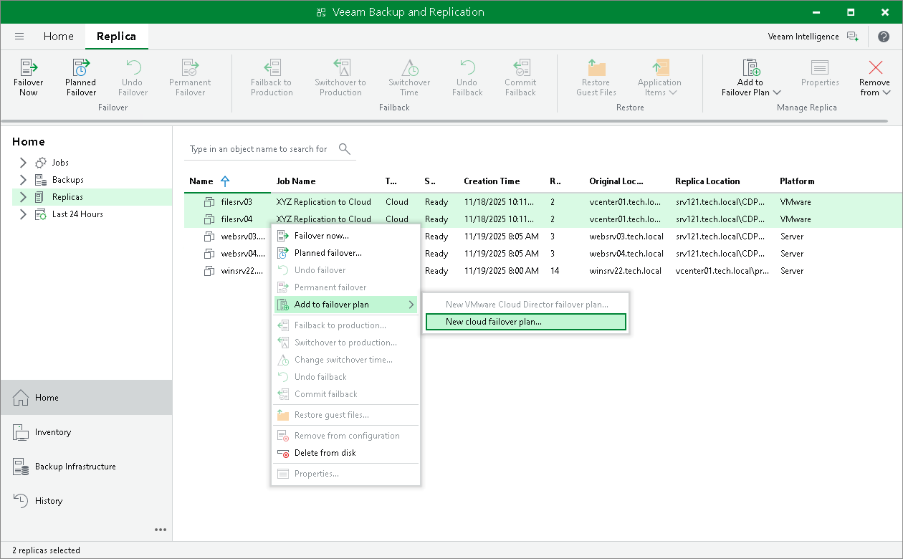

In this article

To launch the Cloud Failover Plan wizard, do one of the following:

* On the Home tab, click Failover Plan and select Cloud Connect (vSphere) or Cloud Connect (Hyper-V).
* Open the Home view, click the Replicas node in the inventory pane, right-click the Failover Plans node and click Failover plan > Cloud Connect (vSphere) or Cloud Connect (Hyper-V). This option is available if you have already configured at least one failover plan.
* Open the Home view, click the Replicas node in the inventory pane, select one or several VMs in the working area, click Add to Failover Plan > New cloud failover plan on the ribbon or right-click one or several VMs in the working area and select Add to failover plan > New cloud failover plan. In this case, the selected VMs will be automatically included into the failover plan. You can add other VMs to the failover plan when passing through the wizard steps.

Page updated 4/17/2024

Page content applies to build 13.0.1.1071
