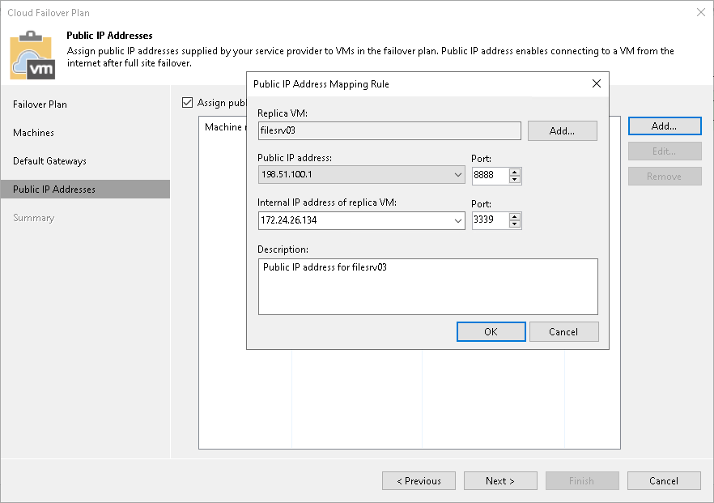

# Step 5. Specify Public IP Addressing Rules

At the Public IP Addresses step of the wizard, specify IP addressing settings for VM replicas. You can create one or several public IP addressing rules to make a VM replica accessible over the internet by a public IP address that the SP has provided to you through the hardware plan.

When your production VM fails over to its replica during full site failover, Veeam Backup & Replication assigns the public IP address that is specified in the rule to the network extension appliance on the cloud host. The network extension appliance redirects traffic from this public IP address to the IP address of a VM replica in the internal VM replica network. As a result, a VM replica for which you have created the public IP addressing rule can be accessed over the internet like a production VM without interrupting the production site operation.

To create a public IP address mapping rule:

1. Select the Assign public IP addresses to use during full site failover option and click Add.
2. In the Public IP Address Mapping Rule window, in the Replica VM field, click Add VM and select a VM replica that you want to make accessible over the internet.
3. In the Public IP address field, select a public IPv4 or IPv6 address from the list of IP addresses allocated to you by the SP. In the Port field, specify the number of the port on the SP network extension appliance from which Veeam Backup & Replication will redirect traffic to the VM replica.

You cannot specify port 22 as a port for the public IP address that is assigned to the network extension appliance. Veeam Backup & Replication uses this port for communication with the network extension appliance.

1. In the Internal IP address of replica VM field, select the IP address of the VM replica in the internal network. In the Port field, specify the number of the network port on the VM replica to which Veeam Backup & Replication will redirect traffic from the network extension appliance.

For Linux-based VM replicas, you must specify the internal IP address manually, because Veeam Backup & Replication cannot detect an IP address of a Linux-based VM in the tenant production network.

1. In the Description field, provide a description for future reference.
2. Click OK.

