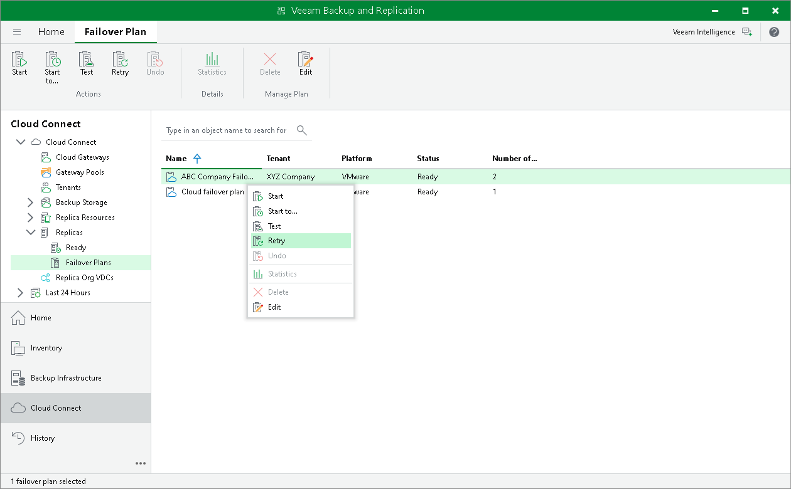

In this article

The SP can retry failover by a tenant cloud failover plan in case the full site failover process fails before all tenant VMs fail over to their replicas on the cloud host.

To retry failover by a cloud failover plan:

1. Open the Cloud Connect view.
2. In the inventory pane, expand the Replicas node and click Failover Plans.
3. In the working area, right-click the necessary cloud failover plan and select Retry.

Page updated 4/17/2024

Page content applies to build 13.0.1.1071
