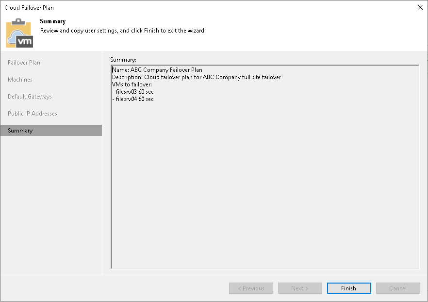

In this article

At the Summary step of the wizard, complete the procedure of a cloud failover plan creation.

1. Review the configuration information on the created cloud failover plan.
2. Click Finish to exit the wizard.

Page updated 7/26/2023

Page content applies to build 13.0.1.1071
