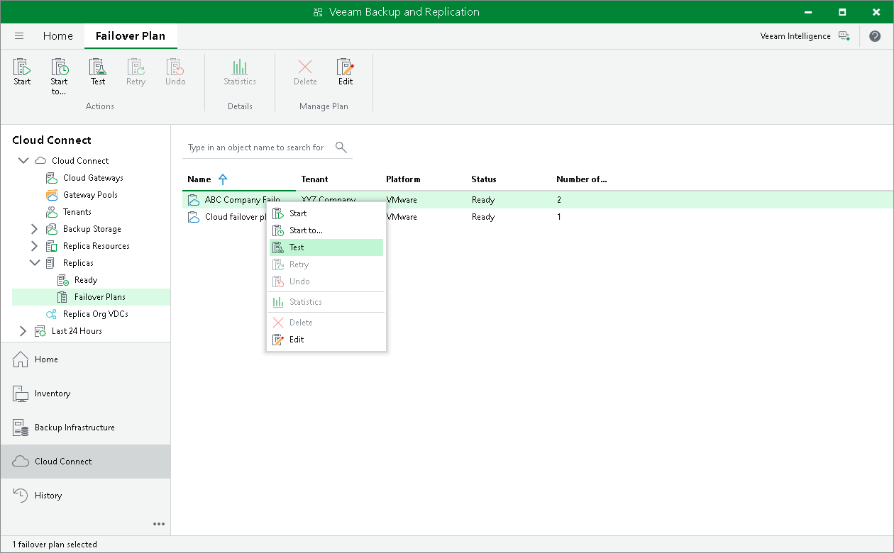

In this article

The SP can test a tenant cloud failover plan to ensure replicated tenant VMs on the cloud host successfully start and can be accessed from external network after failover. When you test a cloud failover plan, Veeam Backup & Replication does not switch from a production VM to its replica. Instead, it reverts every VM replica in the cloud failover plan to the latest restore point, boots the replica operation system, waits for the VM replica to reach a "stabilization point" using the Stabilization by IP algorithm and checks if the VM replica responds to ping requests.

This operation is supported for cloud failover plans that contain snapshot-based replicas and failover plans that contain CDP replicas.

|  |
| --- |
| Note |
| Consider the following limitations:   * Veeam Backup & Replication does not support this operation for failover plans that contain CDP replicas with I/O filters older than version 12.1 installed on the cluster where the VMs that you plan to protect reside and where replicas will reside. To learn more about updating I/O filters, see the [Updating and Uninstalling I/O Filter](https://helpcenter.veeam.com/docs/vbr/userguide/cdp_io_filter_remove.html?ver=13) section in the Veeam Backup & Replication User Guide. * If the SP starts the cloud failover plan test for CDP replicas created with VBR version 12.2 (or earlier), long-term retention policy creation will be stopped while testing. |

|  |
| --- |
| Tip |
| To keep CDP replica VMs running, for example, to reach data from the VM or from an application installed on the VM, you can use Veeam PowerShell cmdlets. To perform the operation, use the KeepAlive parameter. For detailed instructions, see the [Start-VBRFailoverPlan](https://helpcenter.veeam.com/docs/vbr/powershell/start-vbrfailoverplan.html?ver=13) section in the Veeam PowerShell Reference.  The following limitations apply to the operation:   * You can use the keep alive mode only for cloud failover plans that contain CDP replicas. This operation is not supported for cloud failover plans that contain snapshot-based replicas. * By default, this operation is available only for the SP. The SP can use the CdpTenantTestFailoverKeepAliveDurationLimitMin registry key to allow this operation to tenants. The key also defines the allowed keep alive time for tenant CDP replicas. For details, see [Allowing Tenants to Keep CDP Replicas Running](#keepalive). |

To test a cloud failover plan:

1. Open the Cloud Connect view.
2. In the inventory pane, expand the Replicas node and click Failover Plans.
3. In the working area, right-click the necessary cloud failover plan and select Test.

Allowing Tenants to Keep CDP Replicas Running

The SP can use a registry key to let tenants keep CDP replica VMs running while testing cloud failover plans. The registry key allows the tenant to keep CDP replicas running and limits the allowed duration of the keep alive mode.

To use the registry key, complete the following steps:

1. On the SP Veeam backup server, launch the Registry Editor.
2. Create the key HKEY\_LOCAL\_MACHINE\SOFTWARE\Veeam\Veeam Backup and Replication\CdpTenantTestFailoverKeepAliveDurationLimitMin (REG\_SZ).
3. As a registry value, enter the number of minutes to set the keep alive time for CDP replicas.

You can set CDP replicas to run in the keep alive mode for a maximum of 24 hours.

Page updated 11/26/2025

Page content applies to build 13.0.1.1071
