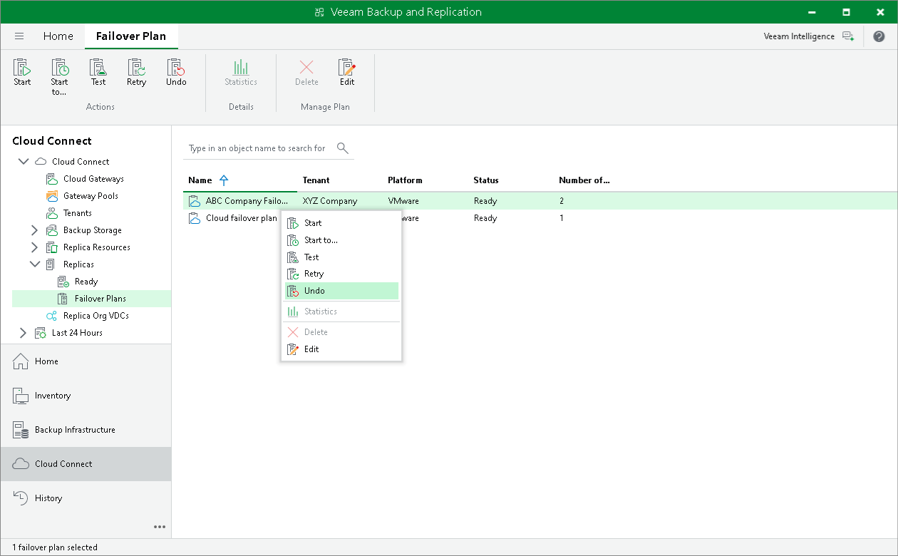

# Undoing Failover by Cloud Failover Plan

The SP can undo failover for all tenant VMs added to the cloud failover plan at once. When you undo failover, you switch the workload back to original VMs and discard all changes that were made to tenant VM replicas during failover.

To undo failover by a cloud failover plan:

1. Open the Cloud Connect view.
2. In the inventory pane, expand the Replicas node and click Failover Plans.
3. In the working area, click the necessary cloud failover plan and click Undo on the ribbon or right-click the necessary cloud failover plan and select Undo.
4. In the displayed window, click Yes to confirm the operation.

