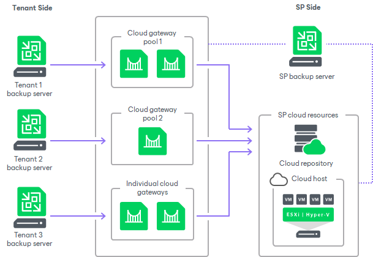

# Cloud Gateway Pool

In large-scale Veeam Cloud Connect infrastructures with multiple cloud gateways, the SP may want to restrict access to some of the cloud gateways or allocate a dedicated cloud gateway to a specific tenant. For example, this may be required in the following situations:

* To comply with regulations requiring that traffic between the tenant backup server and the SP Veeam Cloud Connect infrastructure components goes only through cloud gateways located in a specific region.
* To provide a tenant with a quicker communication channel to the SP Veeam Cloud Connect infrastructure components.

For such scenarios, Veeam Backup & Replication offers the concept of a cloud gateway pool. The cloud gateway pool is a logical entity that groups cloud gateways intended for use by a specific tenant. The SP can organize cloud gateways deployed in the Veeam Cloud Connect infrastructure into cloud gateway pools and provide separate cloud gateway pools to different tenants.

The SP can configure the desired number of cloud gateway pools in the Veeam Cloud Connect infrastructure. Each cloud gateway pool can comprise one or more cloud gateways.

To let the tenant use the cloud gateway pool, the SP must assign the cloud gateway pool to the tenant in the properties of the tenant account. The SP can assign a separate cloud gateway pool to each tenant, assign multiple cloud gateway pools to a single tenant or assign the same cloud gateway pool to multiple tenants.

Tenants to whom the SP does not assign a cloud gateway pool can use only those cloud gateways that are not a part of any cloud gateway pool.

Cloud gateways in a cloud gateway pool operate in the similar way as regular cloud gateways. As well as regular cloud gateways, cloud gateways operating as a part of the pool support automatic failover. If the primary cloud gateway is unavailable, Veeam Backup & Replication fails over to another cloud gateway in the same pool.

By default, in case all cloud gateways in the cloud gateway pool are unavailable for some reason, the tenant Veeam backup server cannot communicate with the Veeam Cloud Connect infrastructure components on the SP side. However, the SP can allow a specific tenant to fail over to cloud gateways that are not a part of a cloud gateway pool.

Related Tasks

* [Configuring Cloud Gateway Pools](cloud_gateway_pool_add.md)
* [Assigning Cloud Gateway Pools](cloud_connect_user_throttling.md#pools)

