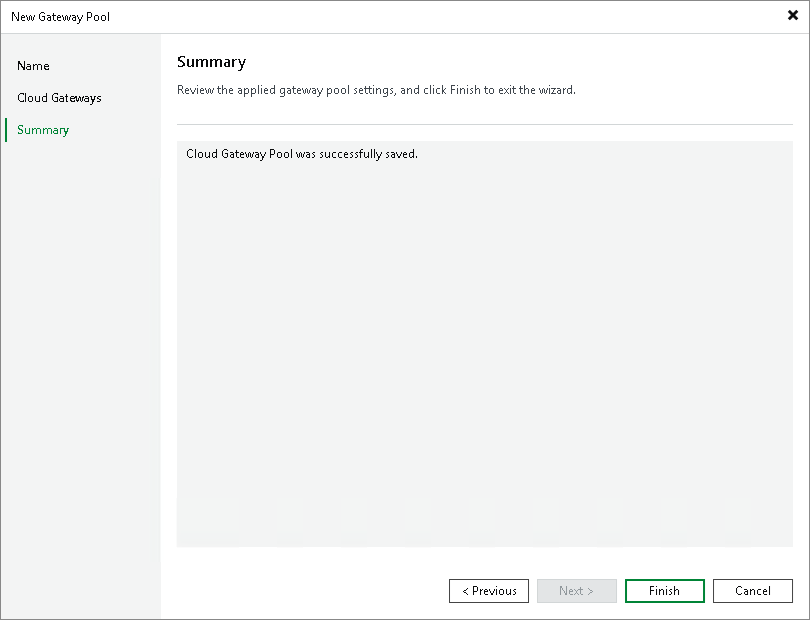

# Step 4. Finish Working with Wizard

At the Summary step of the wizard, complete the procedure of cloud gateway pool configuration.

1. Review the information about the added cloud gateway pool.
2. Click Finish to exit the wizard.

Page updated 2026-08-03

