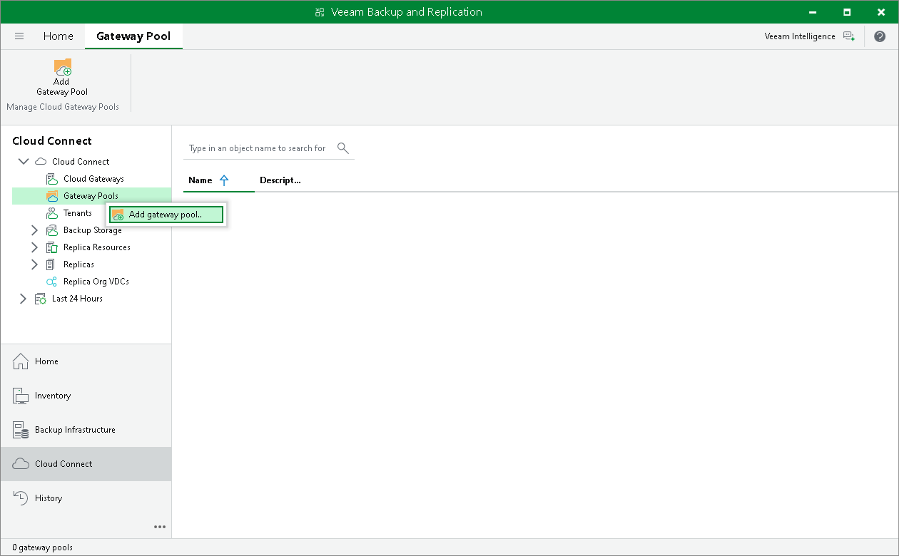

In this article

To launch the New Gateway Pool wizard, do one of the following:

* Open the Cloud Connect view. Click the Gateway Pools node in the inventory pane and click Add Gateway Pool on the ribbon.
* Open the Cloud Connect view. Right-click the Gateway Pools node in the inventory pane and select Add gateway pool.

Page updated 5/22/2024

Page content applies to build 13.0.1.1071
