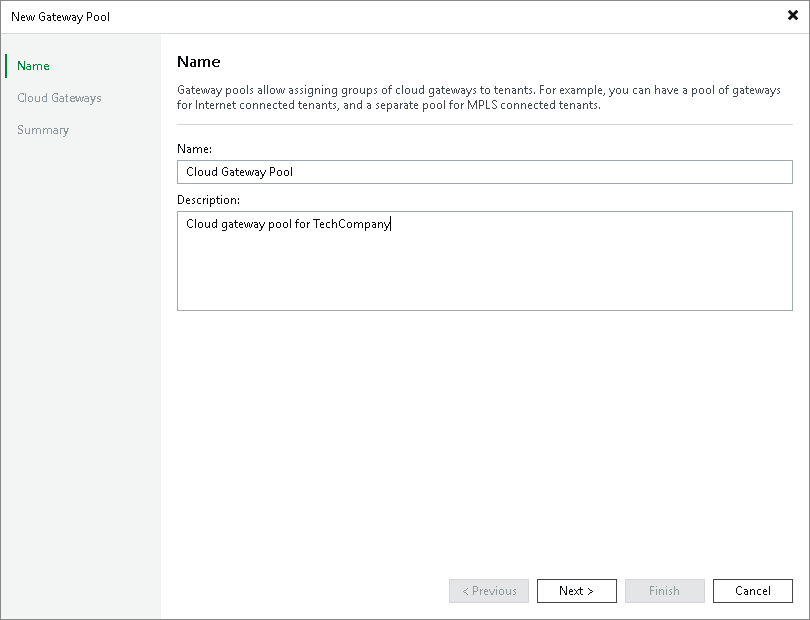

In this article

At the Name step of the wizard, specify a name and description for the cloud gateway pool.

1. In the Name field, specify a name for the cloud gateway pool.
2. In the Description field, provide a description for future reference. The default description contains information about the user who added the cloud gateway pool, date and time when the cloud gateway pool was added.

Page updated 1/25/2024

Page content applies to build 13.0.1.1071
