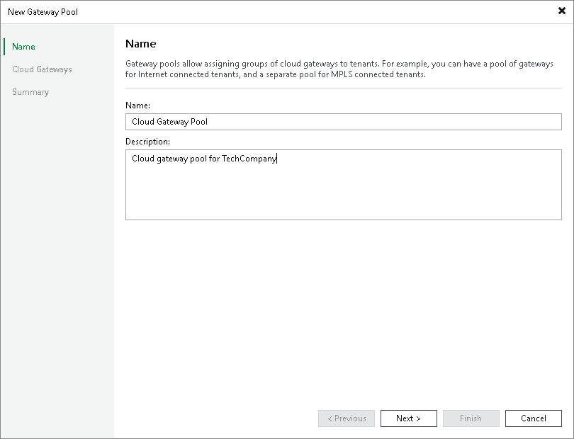

# Step 2. Specify Cloud Gateway Pool Name and Description

At the Name step of the wizard, specify a name and description for the cloud gateway pool.

1. In the Name field, specify a name for the cloud gateway pool.
2. In the Description field, provide a description for future reference. The default description contains information about the user who added the cloud gateway pool, date and time when the cloud gateway pool was added.

Page updated 2026-08-04

