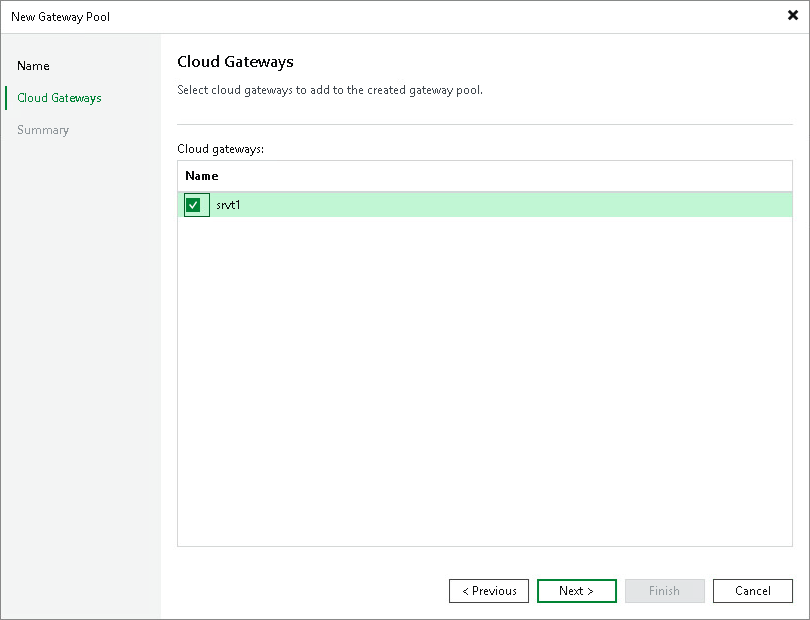

In this article

At the Cloud Gateways step of the wizard, from the Cloud gateways list, select one or more cloud gateways that you want to add to the cloud gateway pool.

|  |
| --- |
| Note |
| The Cloud gateways list contains cloud gateways that are not added to any cloud gateway pool yet. Cloud gateways that are already added to a cloud gateway pool are not displayed in the list. You cannot add a cloud gateway that is a part of a cloud gateway pool to another cloud gateway pool. |

Page updated 11/6/2025

Page content applies to build 13.0.1.1071
