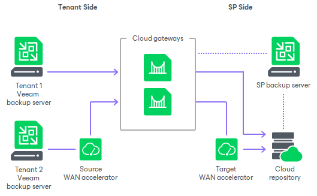

In this article

To expose cloud resources to tenants, the SP must configure the Veeam Cloud Connect infrastructure.

|  |
| --- |
| Note |
| Consider the following:   * The SP must not share Veeam Backup & Replication components (backup server, backup proxies, backup repositories, and so on) between the Veeam Cloud Connect infrastructure and regular Veeam backup infrastructure used to protect the SP virtualization environment. * If the SP has multiple backup servers deployed in the Veeam Cloud Connect infrastructure, they must not share Veeam Backup & Replication components between these backup servers. * The SP can deploy multiple backup proxies in the Veeam Cloud Connect infrastructure. For more information, see [Backup Proxies](cloud_connect_proxies.md). |

Veeam Cloud Connect Backup

To expose cloud repository resources to tenants, the SP must configure the Veeam Cloud Connect Backup infrastructure. The Veeam Cloud Connect Backup infrastructure comprises the following components:

Components on the SP side

* [SP Veeam backup server](cloud_connect_sp_vbr.md)
* [One or several cloud gateways](cloud_connect_gateway.md)
* [One or several cloud repositories](cloud_connect_repository.md)
* [Optional] [One or several target WAN accelerators](cloud_connect_wan.md)

Components on the tenant side

* [Tenant Veeam backup server](cloud_connect_user_vbr.md)
* [Optional] [Source WAN accelerator](cloud_connect_wan.md)

Veeam Cloud Connect Replication

To expose cloud host resources to tenants, the SP must configure the Veeam Cloud Connect Replication infrastructure. The Veeam Cloud Connect Replication infrastructure comprises the following components:

Components on the SP side

* [SP Veeam backup server](cloud_connect_sp_vbr.md)
* [One or several cloud gateways](cloud_connect_gateway.md)
* [One or several hardware plans](cloud_connect_hardware_plan.md)
* [Optional] [One or several network extension appliances](cloud_network_extension_appliance.md)
* [Optional] [One or several target WAN accelerators](cloud_connect_wan.md)

Components on the tenant side

* [Tenant Veeam backup server](cloud_connect_user_vbr.md)
* [One or several network extension appliances](cloud_network_extension_appliance.md)
* [Optional] [Source WAN accelerator](cloud_connect_wan.md)

|  |
| --- |
| Note |
| Depending on the replication scenario, the Veeam Cloud Connect Replication infrastructure may require additional components. For example, the SP can use VMware Cloud Director resources instead of hardware plans to provide replication resources to tenants, or offer the CDP functionality to tenants. To learn more, see [Continuous Data Protection (CDP) with Veeam Cloud Connect](cloud_connect_cdp.md) and [VMware Cloud Director Support](cloud_vcloud_director.md). |

Page updated 9/17/2025

Page content applies to build 13.0.1.1071
