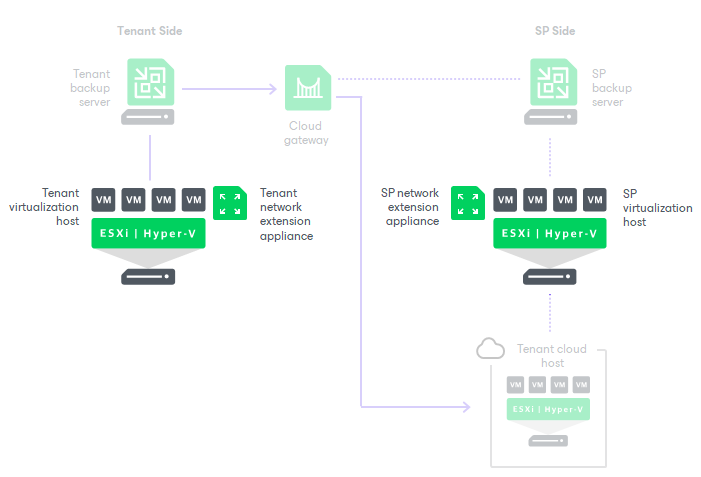
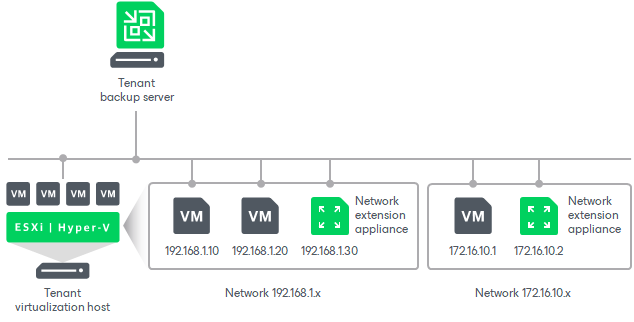
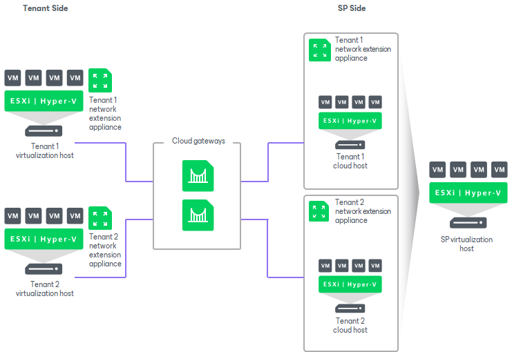

In this article

To enable communication between production VMs on the tenant side, VM replicas on the cloud host, Veeam Cloud Connect infrastructure components and external network nodes, Veeam Backup & Replication uses network extension appliances. The network extension appliance is a Linux-based auxiliary VM created on virtualization hosts where tenant VMs and their replicas reside.

For every tenant who plans to replicate VMs to the cloud host and use all built-in cloud networking and failover capabilities (perform both [full site failover](cloud_connect_full_site_failover.md) and [partial site failover](cloud_connect_partial_site_failover.md)), at least two network extension appliances should be deployed — one on the SP side and the other on the tenant side.

* The network extension appliance on the SP side is deployed on the virtualization host in the SP environment that acts as a replication target. The network extension appliance VM is assigned an IP address from the SP production network and placed to the Cloud\_Connect\_Replication folder and resource pool created on the ESXi host or a dedicated folder on the Hyper-V host.
* The network extension appliance on the tenant side is deployed on the source virtualization host where production VMs reside. The network extension appliance VM is assigned an IP address from the tenant production network and placed to the selected folder and resource pool created on the ESXi host or a selected folder on the Hyper-V host.

The SP specifies network settings for the provider-side network extension appliance when subscribing a tenant to a hardware plan. To learn more, see [Specify Network Extension Settings](cloud_connect_user_network_failover.md).

The tenant specifies network settings for the tenant-side network extension appliance when adding the SP or rescanning resources available from the SP in the tenant Veeam backup console. To learn more, see [Configure Network Extension Appliances](cloud_connect_sp_network_appliance.md).

Veeam Backup & Replication automatically deploys and configures the network extension appliance VM using the specified settings.

|  |
| --- |
| Note |
| The network extension appliance is an obligatory component if you want to use built-in cloud networking and failover capabilities of Veeam Cloud Connect Replication. If the SP or tenant does not specify network extension appliance settings, or if the network extension appliance fails during the failover process, the tenant will not be able to fail over to a VM replica. To learn more about cloud failover, see [Cloud Replica Failover and Failback](cloud_failover_and_failback.md). |

Tenant Network Extension Appliance

Veeam Backup & Replication uses the network extension appliance on the tenant side to route requests between production VMs on the source host and VM replicas on the cloud host after partial site failover.

The network extension appliance connects to a production network using a network adapter. On the tenant side, a separate network extension appliance must be deployed for every production IP network. For example, if there are 2 networks on the tenant production site, the tenant should configure 2 network extension appliances. The network adapter of each network extension appliance on the tenant side gets an IP address from the production network for which this appliance is configured.

The tenant-side network extension appliance is deployed on the tenant virtualization host when the tenant adds the SP in the tenant Veeam backup console. At the Network Extension step of the Service Provider wizard, Veeam Backup & Replication offers the tenant to deploy one network extension appliance with default settings. To deploy the default appliance, Veeam Backup & Replication detects the production network, connects the appliance to this network and tries to assign an IP address to the appliance using DHCP.

When adding the SP, the tenant can check and, if necessary, specify custom settings for the network extension appliance instead of the default ones. For example, the tenant can assign a specific IP address to the appliance. If there are multiple production IP networks on the tenant side, the tenant can instruct Veeam Backup & Replication to deploy the required number of network extension appliances with required settings.

If the tenant does not plan to perform partial site failover, they may omit the network extension appliance deployment when adding the SP.

SP Network Extension Appliance

For every tenant subscribed to a hardware plan, Veeam Backup & Replication deploys a dedicated network extension appliance on the SP virtualization host that acts as a replication target. With the network extension appliance, the SP does not need to reconfigure production network in their Veeam Cloud Connect infrastructure. The SP network extension appliance acts as a gateway between the production network and tenant VM replica networks.

Veeam Backup & Replication uses the network extension appliance on the SP side for the following purposes:

* Routing requests between VM replicas on the cloud host and production VMs on the source host after partial site failover.

All traffic that comes from tenant VM networks to cloud hosts on the SP side is encapsulated in individual VPN tunnels opened between a pair of network extension appliances.

* Separating traffic of the SP production networks and tenant VM networks (by connecting to different VLANs in the SP network infrastructure).
* Providing VM replicas with public IP addresses after full site failover.
* Routing requests between VM replicas on the cloud host and network hosts in the internet after full site failover.

The network extension appliance connects to the SP production network and to virtual networks (VLANs) provided to a tenant through a hardware plan using vNIC adapters. Veeam Backup & Replication does not deploy a separate network extension appliance on the SP side for every IP network in a hardware plan. Instead, it adds to the appliance one vNIC adapter per each VLAN in all hardware plans to which the SP subscribes the tenant.

For example, the SP can configure on the same host one hardware plan with 2 networks and another hardware plan with 3 networks. When the SP assigns both hardware plans to the same tenant, Veeam Backup & Replication will add 6 vNIC adapters to the network extension appliance — 1 vNIC adapter for the SP production network and 5 vNIC adapters for all networks (VLANs) provided to a tenant through hardware plans configured on the SP host.

If the SP assigns to a tenant several hardware plans that utilize resources on different hosts, Veeam Backup & Replication will deploy network extension appliances for this tenant on every host that acts as a replication target.

Network Extension Appliances Interaction

The SP and tenant network extension appliances use a set of networking technologies to automatically establish and maintain a secure connection between a VM network on the tenant side and VM replica network on the SP side. A pair of network extension appliances acts as gateways between the two networks, routing requests from the tenant production site to VM replicas on the cloud host and in the opposite direction.

When a tenant performs the partial site failover operation, a production VM and a failed-over VM replica on the cloud host begin to communicate to each other using network extension appliances in the following way:

1. Veeam Backup & Replication powers on a VM replica on the cloud host.
2. Veeam Backup & Replication powers on a network extension appliance VM on the SP host where the replication target is configured and starts a VPN server on the appliance.
3. On the tenant side, Veeam Backup & Replication powers on a network extension appliance VM, starts a VPN client on the appliance and connects to the VPN server on the SP network extension appliance to establish a secure VPN tunnel between two appliances through the cloud gateway.
4. The network extension appliance on the tenant side receives requests from a production VM that are addressed to a failed-over VM and transmits them to the appliance on the SP side through the VPN tunnel.
5. The network extension appliance on the SP side accepts requests from the tenant appliance and transmits them to the VM replica.
6. VM replica receives a request from the SP network extension appliance.
7. VM replica sends a request to the production VM in the similar order.
8. Production VM and VM replica continue communication through a secure VPN tunnel.

Limitations for Network Extension Appliance

The network extension appliance deployed on the SP side has the following limitations:

* The network extension appliance supports one failover operation type at a time. A tenant cannot perform partial site failover and full site failover simultaneously.
* The network extension appliance does not support usage of port 22 as a port for a public IP address in public IP addressing rules. Veeam Backup & Replication uses this port for communication with the network extension appliance. To learn more about public IP addressing settings, see [Specify Public IP Addressing Rules](cloud_failover_plan_public_ip.md).
* You cannot deploy a network extension appliance on the following types of storage:

* VMware Virtual Volumes (VVol)
* Datastore Cluster

Page updated 11/8/2025

Page content applies to build 13.0.1.1071
