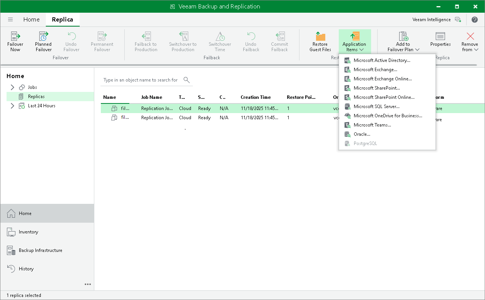

# Restoring Application Items

You can use Veeam Explorers to restore application items from snapshot-based replicas on the cloud host.

Veeam Backup & Replication lets you restore items of the following applications:

* Microsoft Active Directory
* Microsoft Exchange
* Microsoft SharePoint
* Microsoft SQL Server
* Microsoft OneDrive for Business
* Microsoft Teams
* Oracle
* PostgreSQL

For replicas on the cloud host created by replication jobs with guest processing options enabled, the procedure of application-item restore does not differ from the regular one. To perform application-item restore, do either of the following:

* Open the Home view, in the inventory pane select Replicas. In the working area, select the necessary VM and click Application Items > <Application> on the ribbon.
* Open the Home view, in the inventory pane select Replicas. In the working area, right-click the necessary VM and select Restore application items > <Application>.

Then follow instructions in the procedure for the required application. For details, see the [Application Item Restore](https://helpcenter.veeam.com/docs/vbr/userguide/restore_veeam_explorers.html?ver=13) section in the Veeam Backup & Replication User Guide.

The list of available data recovery operations differs depending on what Veeam Explorer you use. To learn more, see the [Veeam Explorers Overview](https://helpcenter.veeam.com/docs/vbr/userguide/explorers_introduction.html?ver=13) section in the Veeam Backup & Replication User Guide.

