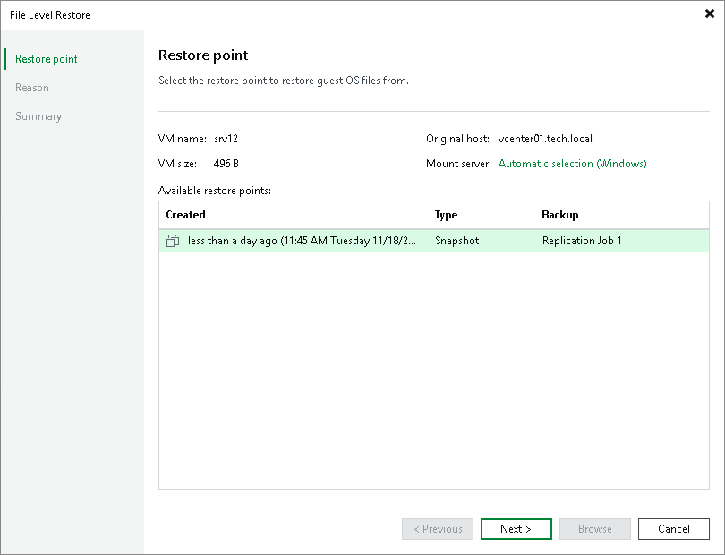
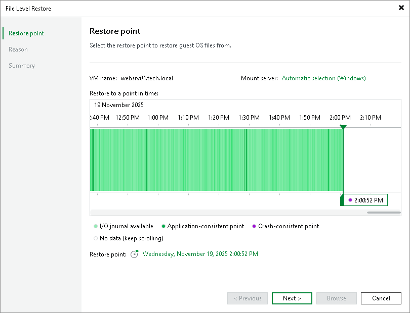
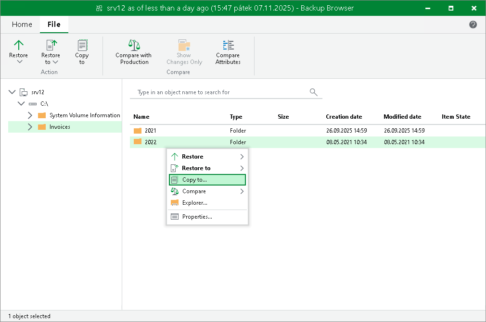

In this article

You can restore individual Microsoft Windows guest OS files from replicas of Microsoft Windows VMs on the cloud host. This operation is supported for both snapshot-based replicas and CDP replicas.

During file-level recovery, Veeam Backup & Replication publishes VM replica virtual disk files directly into the Veeam backup server file system with the help of Veeam's proprietary driver. After VM disks are mounted, you can use the Veeam Backup Browser or Microsoft Windows Explorer to copy necessary files and folders to the local machine drive, save them in a network shared folder or point any applications to restored files and work with them as usual.

|  |
| --- |
| Note |
| This section describes only basic steps that you must take to restore VM guest OS files. To get a detailed description of all settings of the restore process, see the [Guest OS File Restore](https://helpcenter.veeam.com/docs/backup/vsphere/guest_file_recovery.html?ver=120) section in the Veeam Backup & Replication User Guide. |

To restore VM guest OS files of a Microsoft Windows VM replica:

1. Open the Home view.
2. Click the Replicas node in the inventory pane. Right-click the necessary VM replica and select Restore guest files > Microsoft Windows.
3. At the Restore Point step of the wizard, select the necessary restore point.

* [For snapshot-based replicas] Select the necessary restore point from the list.

* [For CDP replicas] Select the necessary point in time to restore to. The colour indicates the amount of data traffic for each time point.

1. At the Reason step of the wizard, specify the reason for future reference.
2. Click Next. Then click Browse.
3. Veeam Backup & Replication will display a file browser with the file system tree of the VM. Right-click the necessary file or folder and select the necessary option.

* To restore a file or folder to its original location on the original VM:

* Select Restore > Overwrite if you want to overwrite the original file or folder on the VM guest OS with the file or folder restored from the replica.
* Select Restore > Keep if you want to save a file or folder restored from the replica next to the original file or folder. Veeam Backup & Replication will add the \_RESTORED\_YYYYMMDD\_HHMMSS postfix to the original file or folder name and save the restored file or folder in the same location where the original file or folder resides.

* To restore a file or folder to another VM in the Veeam backup infrastructure:

* Select Restore to > Overwrite if you want to overwrite the file or folder on the VM guest OS with the file or folder restored from the replica in case the file or folder with the same name resides on the target VM.
* Select Restore to > Keep if you want to save a file or folder restored from the replica next to the file or folder on the VM guest OS in case the file or folder with the same name resides on the target VM. Veeam Backup & Replication will add the \_RESTORED\_YYYYMMDD\_HHMMSS postfix to the original file or folder name and save the restored file or folder in the specified location.

If you select one of this options, select the target VM and target path for the restored file or folder, and click OK.

* To restore to the original location only those files or folders that have changed on the original VM since the restore point for the replica was created, select Compare > Compare. Then right-click the file or folder and select one of the following options:

* Select Restore changed only > Overwrite if you want to overwrite the original file or folder on the VM guest OS with the file or folder restored from the replica.
* Select Restore changed only > Keep if you want to save a file or folder restored from the replica next to the original file or folder. Veeam Backup & Replication will add the \_RESTORED\_YYYYMMDD\_HHMMSS postfix to the original file or folder name and save the restored file or folder in the same location where the original file or folder resides.

* To save a file or folder on the local machine or in a network shared folder, select Copy to, specify a path to the destination location and click OK.

To learn more, see the [Finalize Restore](https://helpcenter.veeam.com/docs/backup/vsphere/guest_restore_save_vm.html?ver=120) section in the Veeam Backup & Replication User Guide.

Page updated 8/26/2024

Page content applies to build 13.0.1.1071
