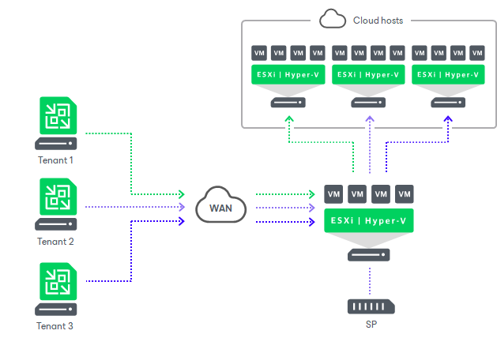

In this article

With Veeam Backup & Replication, SPs can offer Disaster Recovery as a Service (DRaaS) to their customers.

Veeam Backup & Replication provides disaster recovery through image-based VM replication. The SP can expose resources of their virtualization environment to tenants as cloud hosts.

Tenants can utilize cloud hosts provided by the SP to create VM replicas offsite. In case of a disaster on the production site, tenants can quickly and easily switch to VM replicas in the cloud and use the SP infrastructure as a remote disaster recovery site.

The SP can provide Veeam Cloud Connect Replication resources for the following virtualization platforms:

* VMware vSphere
* Microsoft Hyper-V

As well as the Veeam Cloud Connect Backup infrastructure, the Veeam Cloud Connect Replication infrastructure has a multi-tenant architecture. The SP allocates computing, storage and network resources for a replication target and provides them to tenants through hardware plans. For the SP, a hardware plan is an abstraction layer that lets the SP virtually partition a virtualization host or cluster into multiple replication targets. As a result, the SP can expose replication resources to several tenants and store tenants’ data in the cloud in an isolated and segregated way.

For a tenant, a hardware plan appears as a cloud host that can be used as a regular target host for off-site replication.

To make VM replicas on the cloud host accessible over the network after failover, Veeam Backup & Replication provides each tenant with network resources — network extension appliances and dedicated VLANs. The tenant can fail over a group of production VMs (full site failover) or individual VMs (partial site failover) to VM replicas on the cloud host. Veeam Backup & Replication establishes a secure channel between VM replicas in the cloud and VMs on the production site and offers traffic encryption capabilities.

|  |
| --- |
| Note |
| Consider the following:   * The SP can also use VMware Cloud Director to allocate replication resources for tenant VMware vSphere VMs. To learn more, see [VMware Cloud Director Support](cloud_vcloud_director.md). * Apart from snapshot-based replication, the SP can provide the Continuous Data Protection (CDP) functionality to tenants. To learn more, see [Continuous Data Protection (CDP) with Veeam Cloud Connect](cloud_connect_cdp.md). |

Data protection and disaster recovery tasks targeted at the cloud host are performed by tenants. Tenants can set up necessary replication jobs and perform failover operations on Veeam backup servers deployed on their side. Tenants can perform the following operations:

* Replicate VMs to the cloud host.
* Perform failover tasks with VM replicas on the cloud host:

* [Full site failover](cloud_connect_full_site_failover.md), when all critical production VMs fail over to their replicas on the cloud host in case the whole production site becomes unavailable.
* [Partial site failover](cloud_connect_partial_site_failover.md), when one or several VMs become corrupted and fail over to their replicas on the cloud host.

* Perform failback tasks with VM replicas on the cloud host.

Tasks associated with full site failover can be performed either by a tenant or by the SP. This lets the SP test the full site failover process and switch the tenant production site to the cloud host upon a request from the tenant if the tenant has no access to the backup infrastructure after a disaster.

Page updated 11/8/2025

Page content applies to build 13.0.1.1071
