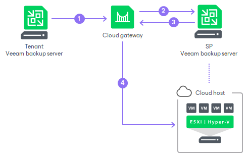

# How Veeam Cloud Connect Replication Works

Tenants who plan to replicate their VMs to the cloud must configure replication jobs on their Veeam backup servers and target them at the cloud host. When a job starts, Veeam Backup & Replication performs the following actions:

1. The tenant starts a replication job. The Veeam backup server on the tenant side sends a request to the cloud gateway to access the cloud host.
2. The cloud gateway passes this request to the SP Veeam backup server.
3. The SP Veeam backup server provides a TLS certificate and establishes a secure connection between the SP Veeam backup server and tenant Veeam backup server.
4. VM data from the tenant side is transported through the cloud gateway to the cloud host. If the SP has several cloud gateways, VM data is transported through the least loaded cloud gateway being online.

In case of a disaster on the tenant production site, when one or several VMs become corrupted, a tenant can fail over to VM replicas on the cloud host. To learn more, see [Cloud Replica Failover And Failback](cloud_failover_and_failback.md).

