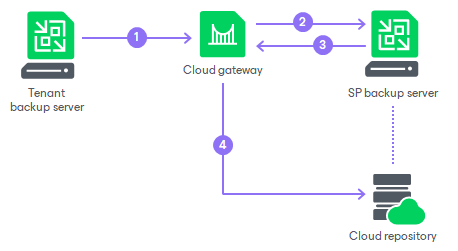

# How Veeam Cloud Connect Backup Works

Tenants who plan to store their data in the cloud must configure backup or backup copy jobs on their Veeam backup servers and target them at the cloud repository. When a job starts, Veeam Backup & Replication performs the following actions:

1. The tenant starts a backup or backup copy job. The Veeam backup server on the tenant side sends a request to the cloud gateway to access the cloud repository.
2. The cloud gateway passes this request to the SP Veeam backup server.
3. The SP Veeam backup server provides a TLS certificate and establishes a secure connection between the SP Veeam backup server and tenant Veeam backup server.
4. VM data from the tenant side is transported through the cloud gateway to the cloud repository. If the SP has several cloud gateways, VM data is transported through the least loaded cloud gateway being online.

The restore process from the cloud repository is performed in a similar manner. The tenant Veeam backup server creates a communication channel with the cloud repository through the cloud gateway and retrieves VM data over this channel.

