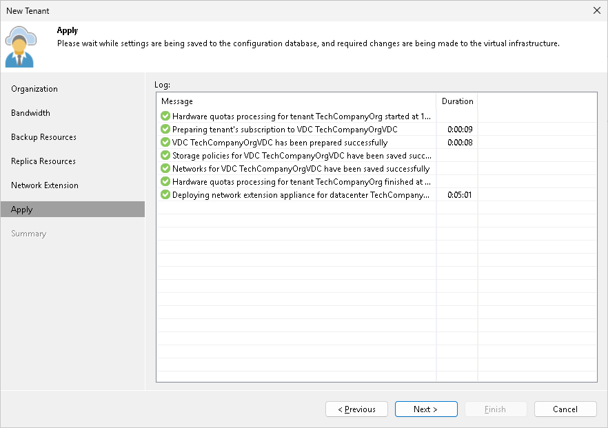

In this article

The Apply step is available if you selected the Replication resources option at the Organization step of the wizard.

At this step of the wizard, Veeam Backup & Replication will assign the cloud resources to the tenant. Wait for the required operations to complete and click Next to continue.

Page updated 1/25/2024

Page content applies to build 13.0.1.1071
