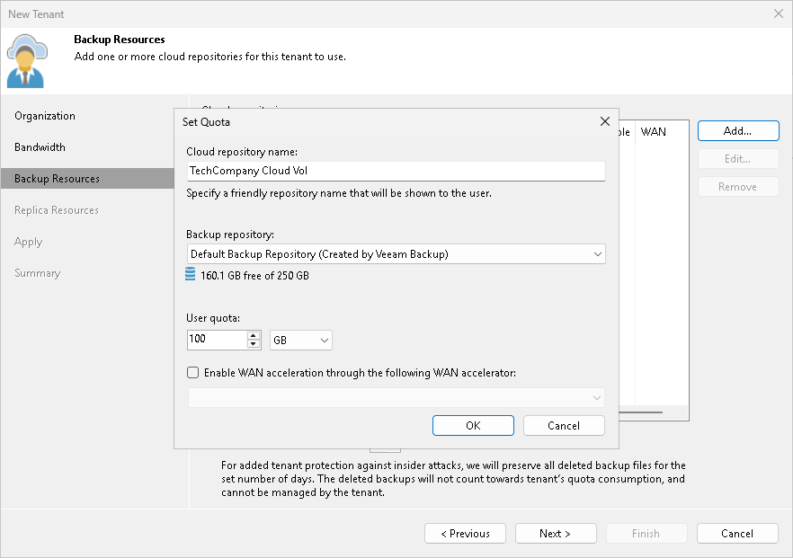

In this article

The Backup Resources step of the wizard is available if you selected the Backup storage option at the [Organization](cloud_vcd_tenant_settings.md) step of the wizard. You can use this step to specify cloud repository quota settings for the created tenant account.

The procedure of assigning backup resources to a VMware Cloud Director tenant account does not differ from the same procedure for a simple tenant account. You can assign to the tenant a single quota on one cloud repository or several quotas on different cloud repositories.

To assign a cloud repository quota:

1. Click Add on the right of the Cloud repositories list.
2. In the Cloud repository name field of the Set Quota window, enter a friendly name for the cloud repository you want to present to the tenant. The name you enter will be displayed in the list of backup repositories at the tenant side.
3. From the Backup repository list, select a backup repository in your backup infrastructure whose space resources must be allocated to the tenant.
4. In the User quota field, specify the amount of space you want to allocate to the tenant on the selected backup repository.
5. [For tenants who plan to use WAN accelerators] Select the Enable WAN acceleration through the following WAN accelerator check box and choose a target WAN accelerator configured at the SP side. The source WAN accelerator is configured on the tenant side. The tenant will select the source WAN accelerator on their side when configuring a backup copy job.
6. Click OK.
7. Repeat steps 1–6 for all backup repositories in your backup infrastructure whose resources you want to allocate to the tenant.
8. If you want to protect tenant backups against unwanted deletion, select the Keep deleted backup files for <N> days check box and specify the number of days to keep a backup in the recycle bin after a backup is deleted by the tenant. To learn more, see [Insider Protection](cloud_connect_bin.md).

|  |
| --- |
| Note |
| Consider the following:   * With the Keep deleted backup files for <N> days option enabled, Veeam Backup & Replication will disable retention policy for deleted VMs specified in the properties of a tenant backup job. To avoid keeping redundant data in a cloud repository, it is recommended that the SP enables the Use per-VM backup files option in the properties of the backup repository whose storage resources the SP exposes to tenants as cloud repositories. * If the Keep deleted backup files for <N> days option is enabled in the properties of the tenant account, and the Use per-VM backup files option is not enabled in the properties of the backup repository whose storage resources the SP exposes to the tenant, the tenant will be unable to remove individual VMs from backups in the cloud repository. When the tenant starts the Delete from disk operation for a specific VM in the backup, the operation will complete with an error.  * The Keep deleted backup files for <N> days option is not available if the SP allocates to the tenant a quota on an object storage repository. |

Page updated 1/30/2024

Page content applies to build 13.0.1.1071
