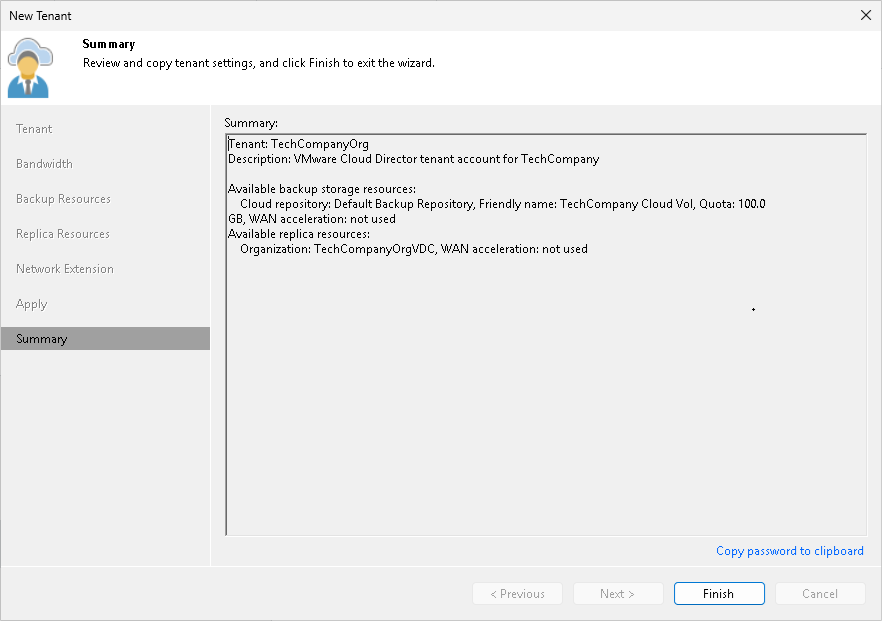

# Step 8. Finish Working with Wizard

At the Summary step of the wizard, complete the procedure of tenant account registration.

1. Review the information about the added tenant account.
2. Click Finish to exit the wizard.

