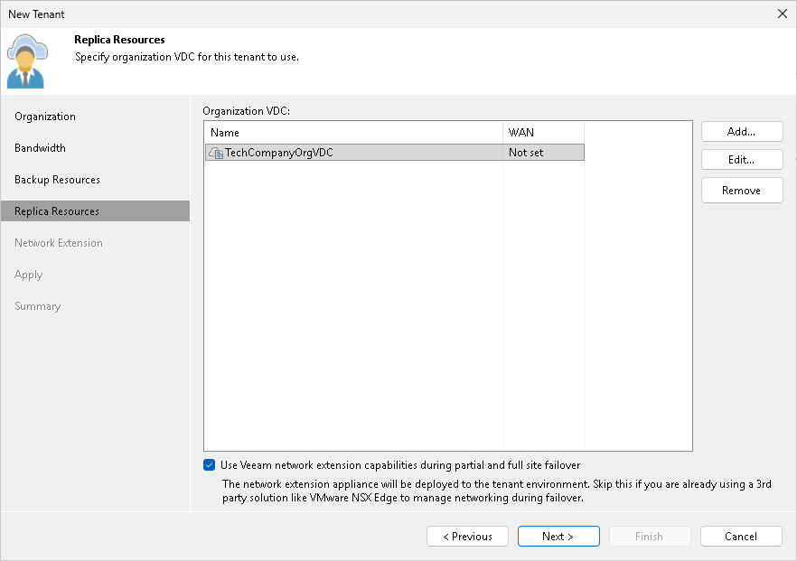

In this article

The Replica Resources step of the wizard is available if you selected the Replication resources option at the [Organization](cloud_vcd_tenant_settings.md) step of the wizard. At this step of the wizard, specify what organization VDC will be used to provide resources to tenant VM replicas.

To assign an organization VDC to the tenant:

1. In the Organization VDC list, review organization VDCs that will be available to the tenant as cloud hosts. By default, Veeam Backup & Replication displays in this list all organization VDCs allocated to the organization in VMware Cloud Director. If you do not want to provide some of the organization VDCs to the tenant as cloud hosts, select the necessary organization VDC and click Remove.
2. [For tenants who plan to use WAN accelerators] Specify WAN acceleration settings for organization VDCs that will be used as a target for tenant VM replicas:

1. In the Organization VDC list, select the organization VDC for which you want to enable WAN acceleration, and click Edit.
2. In the Edit VDC org window, select the Enable WAN acceleration through the following WAN accelerator check box and choose a target WAN accelerator configured at the SP side. The source WAN accelerator is configured at the tenant side. The tenant will select the source WAN accelerator at their side when configuring a replication job.
3. Click OK.
4. Repeat steps a–c for all organization VDCs for which you want to enable WAN acceleration.

1. Select the Use Veeam network extension capabilities during partial and full site failover check box to allocate network resources for performing failover tasks. With this option enabled, the New Tenant wizard will include the additional [Network Extension](cloud_vcd_tenant_network.md) step.

If you use an NSX Edge gateway or IPsec VPN connection to enable network access to tenant VM replicas after failover, you do not need to deploy the network extension appliance in the Veeam Cloud Connect infrastructure. Instead, you must configure an NSX Edge gateway or IPsec VPN connection in VMware Cloud Director. Make sure that the Use Veeam network extension capabilities during partial and full site failover check box is cleared, and then click Apply to proceed to the next step of the wizard.

Page updated 7/25/2023

Page content applies to build 13.0.1.1071
