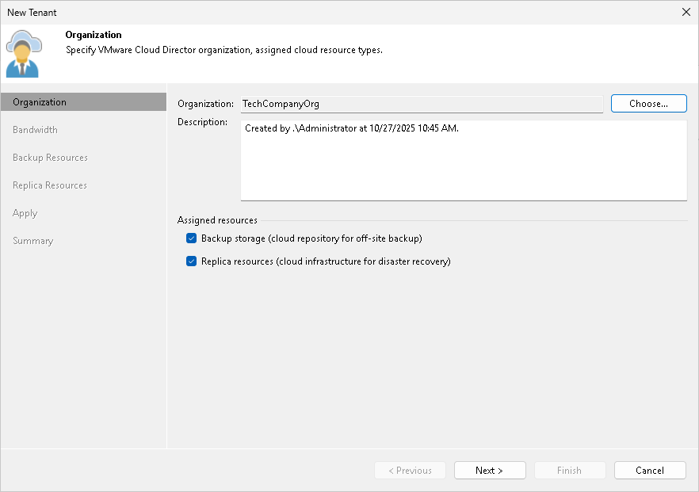

In this article

At the Organization step of the wizard, specify tenant account settings for the tenant.

1. Click Choose on the right of the Organization field.
2. In the Select Organization window, select the VMware Cloud Director organization whose organization VDC resources you want provide to the tenant as cloud hosts.
3. In the Description field, specify a description for the created tenant account. The default description contains information about the user who created the account, date and time when the account was created.
4. In the Assigned resources section, select what types of Veeam Cloud Connect resources you want to provide to the tenant:

* Backup storage — Veeam Cloud Connect Backup resources. With this option enabled, the New Tenant wizard will include an additional Backup Resources step. At the Backup Resources step of the wizard, you can assign a quota on the cloud repository to the tenant. To learn more, see [Allocate Backup Resources](cloud_vcd_tenant_backup.md).
* Replica resources — Veeam Cloud Connect Replication resources. With this option enabled, the New Tenant wizard will include an additional Replica Resources step. At the Replica Resources step of the wizard, you can select an organization VDC that will act as a cloud host for tenant VM replicas. To learn more, see [Allocate Replication Resources](cloud_vcd_tenant_replication.md).

|  |
| --- |
| Note |
| You cannot specify lease settings for VMware Cloud Director tenant accounts. Lease settings for a VMware Cloud Director organization are managed in VMware Cloud Director. |

Page updated 1/30/2024

Page content applies to build 13.0.1.1071
