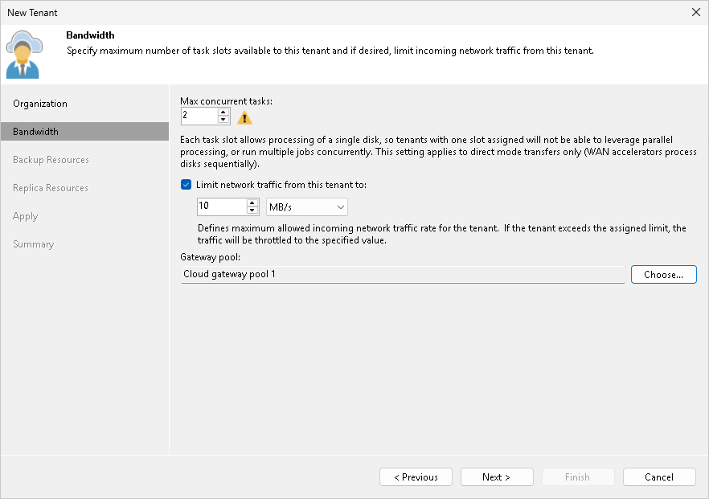
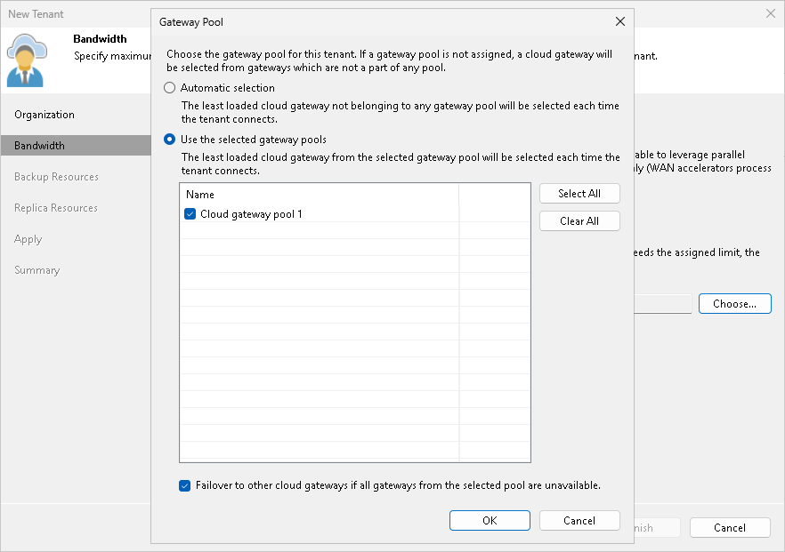

In this article

At the Bandwidth step of the wizard, specify task and bandwidth limitation settings for the tenant. Limiting bandwidth and parallel data processing capabilities for tenants helps avoid overload of cloud gateways, backup proxies, backup repositories and network equipment on the SP side.

1. In the Max concurrent tasks field, specify the maximum number of concurrent tasks for the tenant. If this value is exceeded, Veeam Backup & Replication will not start a new task until one of current tasks finishes. To learn more, see [Parallel Data Processing](data_encryption_and_throttling.md#parallelprocessing).

|  |
| --- |
| Note |
| The specified number of concurrent tasks will be available to the tenant regardless of the number of concurrent tasks defined in the properties of a cloud repository exposed to this tenant. |

1. To limit the data traffic coming from the tenant side to the SP side, select the Limit network traffic from this tenant to check box. With this option enabled, you can specify the maximum speed for transferring tenant data to the SP side.

This option also applies to the traffic coming from a cloud repository in the replica from backup and replica seeding scenarios.

1. In the Gateway pool field, specify what cloud gateways will be available to the tenant. By default, the tenant can use cloud gateways that are not added to any cloud gateway pool. To use this option, make sure that Automatic selection is displayed in the Gateway pool field.

If you want to assign a cloud gateway pool to the tenant, click Choose on the right of the Gateway pool field and select one or more cloud gateway pools. To learn more, see [Assigning Cloud Gateway Pools](#pools).

Assigning Cloud Gateway Pools

You can assign to the tenant one or more cloud gateway pools configured in the Veeam Cloud Connect infrastructure. After you assign a cloud gateway pool to the tenant, communication between the tenant backup server and Veeam Cloud Connect infrastructure components in the SP side will be possible only through cloud gateways added to this pool. You can also allow the tenant to fail over to a cloud gateway that is not added to a cloud gateway pool. This may be useful in a situation where all cloud gateways in the cloud gateway pool assigned to the tenant are unavailable for some reason.

To assign a cloud gateway pool to the tenant:

1. At the Bandwidth step of the wizard, click Choose on the right of the Gateway pool field.
2. In the Gateway Pool window, select Use the selected gateway pools.
3. In the list of available cloud gateway pools, select check boxes next to one or more pools that you want to assign to the tenant. The list of available cloud gateway pools contains pools that you configured in the Veeam Cloud Connect infrastructure.

To select or clear all check boxes in the list at once, you can use the Select All and Clear All buttons.

1. [Optional] You can allow the tenant to fail over to a cloud gateway that is not added to the selected cloud gateway pool in case all cloud gateways in the pool are unavailable for some reason. To do this, select the Failover to other cloud gateways if all gateways from the selected pool are unavailable check box.
2. Click OK.

Page updated 1/30/2024

Page content applies to build 13.0.1.1071
