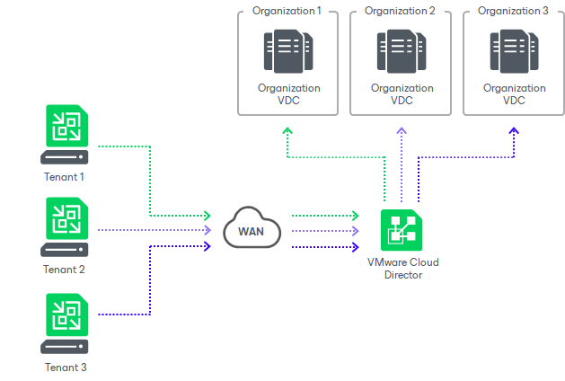

# VMware Cloud Director Support

SPs who have VMware Cloud Director deployed in their infrastructure can expose VMware Cloud Director resources as cloud hosts for tenant VM replicas. This allows such SPs to offer Disaster Recovery as a Service (Veeam Cloud Connect Replication) to tenants without the need to deploy additional VMware vSphere hosts in their virtual infrastructure. Whereas SPs who already provide cloud services based on the VMware Cloud Director technology can now offer new data protection and recovery scenario to their tenants.

To support replication of tenant VMs to VMware Cloud Director, Veeam Backup & Replication does not introduce additional Veeam Cloud Connect infrastructure components. The SP does not need to configure cloud replication resources, such as hardware plans, in Veeam Backup & Replication. Instead, the SP configures replication target resources directly in VMware Cloud Director and provides the tenant with access permissions to these resources.

* The SP allocates one or more organization VDCs to an organization in VMware Cloud Director. Each organization VDC provides CPU, RAM, storage and network resources for tenant VM replicas. To grant access to VMware Cloud Director resources to the tenant, the SP creates for this tenant a VMware Cloud Director tenant account. In the properties of this account, the SP selects an organization whose VDC will act as a cloud host for tenant VM replicas. To learn more, see [VMware Cloud Director Tenant Account](cloud_vcloud_director_tenant.md).
* The tenant adds the SP in the Veeam backup console using credentials of the organization administrator account. After the tenant connects to the SP, organization VDCs allocated to the organization appear in the tenant Veeam backup console as cloud hosts. The tenant can configure replication jobs targeted at these cloud hosts and create VM replicas in VMware Cloud Director.

The tenant can perform the same tasks with VM replicas in VMware Cloud Director as with VM replicas on a regular cloud host provided to the tenant through a hardware plan. To learn more, see [Tasks with Cloud Host](cloud_replication_tasks.md).

The SP can also use VMware Cloud Director resources as a target location for tenant CDP replicas. To learn more, see [Continuous Data Protection (CDP) with Veeam Cloud Connect](cloud_connect_cdp.md).

Related Topics

* [Getting Started with Replication to VMware Cloud Director](cloud_vcloud_director_quickstart.md)
* [Considerations and Limitations for Replication to VMware Cloud Director](cloud_replication_limitations.md#cloud_director)
* [VMware Cloud Director Tenant Account](cloud_vcloud_director_tenant.md)
* [Network Resources for VMware Cloud Director Replicas](cloud_vcloud_director_infrastructure.md)
* [Partial Site Failover for VMware Cloud Director Replicas](cloud_vcloud_director_partial_failover.md)
* [Full Site Failover for VMware Cloud Director Replicas](cloud_vcloud_director_full_failover.md)

Related Tasks

* [Configuring VMware Cloud Director Tenant Account](cloud_vcd_tenant.md)
* [Connecting to Service Providers](cloud_connect_sp.md)
* [Creating Replication Jobs](creating_replication_jobs.md)
* [Creating Cloud Failover Plans for Replicas in VMware Cloud Director](vcloud_failover_plan.md)

