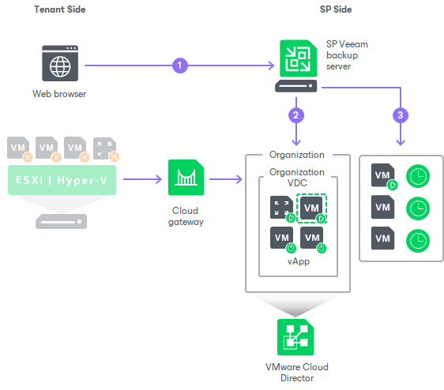

In this article

When the whole tenant production site becomes unavailable because of a software or hardware malfunction, the tenant can perform full site failover. In the full site failover scenario, all critical VMs fail over to their replicas on the cloud host one by one, as a group.

Full site failover for tenant VM replicas in VMware Cloud Director is in many regards similar to full site failover for VM replicas created on a cloud host provided through a hardware plan. To perform full site failover to VM replicas in VMware Cloud Director, the tenant must create a cloud failover plan of a specific type — a VMware Cloud Director failover plan. To learn more, see [Creating Cloud Failover Plans for Replicas in VMware Cloud Director](vcloud_failover_plan.md).

In contrast to the regular full site failover process, full site failover to VM replicas in VMware Cloud Director does not involve usage of the SP network extension appliance. To allow tenant VM replicas to be accessed over the internet, the SP must configure an NSX Edge gateway in VMware Cloud Director. This operation must be performed in advance, before the tenant or SP starts the full site failover operation.

Full site failover is performed in the following way:

1. The tenant asks the SP to start full site failover using the SP Veeam Backup & Replication console.
2. For each VM in the cloud failover plan, Veeam Backup & Replication detects its replica. If some VMs in the cloud failover plan have replicas that are already in the Failover or Failback state, Veeam Backup & Replication suggests that they are processed with the cloud failover plan.
3. The replica VMs are started in the order they appear in the cloud failover plan within the set time intervals.

Page updated 9/17/2025

Page content applies to build 13.0.1.1071
