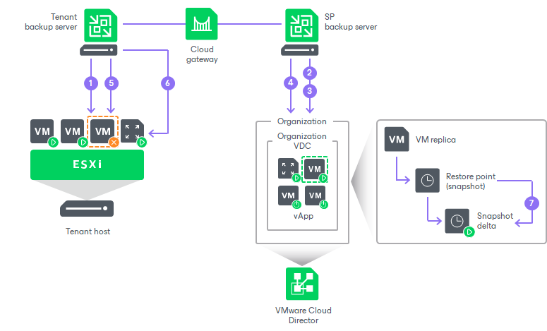

In this article

If one or more tenant VMs become corrupted, but the rest of the production site, including the most critical VMs and Veeam Backup & Replication infrastructure, remain operative, the tenant can perform partial site failover. With partial site failover, the tenant can quickly recover a corrupted VM by failing over to its replica on the cloud host.

To establish a secure connection and enable communication between production VMs and VM replicas in VMware Cloud Director after partial site failover, the SP can use capabilities of VMware Cloud Director or Veeam Backup & Replication. To learn more, see [Network Resources for VMware Cloud Director Replicas](cloud_vcloud_director_infrastructure.md).

Partial site failover for VM replicas created in an organization VDC is performed in the similar way as partial site failover for VM replicas created on a cloud host provided through a hardware plan. The difference is that Veeam Backup & Replication does not start network extension appliances on the SP and tenant sides if network connectivity for tenant VM replicas is provided using an NSX Edge gateway or IPsec VPN connection.

Veeam Backup & Replication performs partial site failover for a VM replica created in VMware Cloud Director in the following way:

1. The tenant starts the partial site failover process for a VM in the tenant Veeam Backup & Replication console.
2. Veeam Backup & Replication rolls back the VM replica on the cloud host to the required restore point. To do this, it reverts the VM replica to the necessary snapshot in the replica chain.
3. Veeam Backup & Replication powers on the VM replica. The state of the VM replica is changed from Normal to Failover. If the original VM still exists and is running, the original VM remains powered on.
4. [Optional] If the SP network extension appliance was deployed in the organization VDC that acts as a cloud host, Veeam Backup & Replication powers on the network extension appliance VM in the organization VDC and configures network settings on the appliance:

* Starts a VPN server on the network extension appliance to establish a secure VPN tunnel through the cloud gateway to the appliance on the tenant side.
* Configures Proxy ARP daemon on the appliance so that the appliance can receive from the VM replica ARP requests addressed to production VMs on the source host and send them to the tenant network extension appliance through the VPN tunnel.

In addition, the SP network extension appliance imports in its vApp all organization VDC networks and connects to these networks. Keep in mind that if the number of organization VDC networks is greater than 9, the failover operation will fail because the number of virtual network adapters for a VMware vSphere VM cannot exceed 10 (one network adapter is used to connect to the management network).

1. Veeam Backup & Replication temporarily puts replication activities for the original VM on hold (until the VM replica returns to the Normal state).
2. [Optional] If the tenant network extension appliance was deployed on the source host, Veeam Backup & Replication powers on the network extension appliance on the tenant side and configures network settings on the appliance:

* Starts a VPN client on the network extension appliance and connects to the VPN server on the network extension appliance on the SP side to establish a secure VPN tunnel through the cloud gateway.
* Configures Proxy ARP daemon on the network extension appliance so that it can receive ARP requests from production VMs addressed to the VM replica and send them to the network extension appliance on the SP side through the VPN tunnel.

1. All changes made to the VM replica while it is running in the Failover state are written to the delta file of the snapshot, or restore point, to which you have selected to roll back.

After the partial site failover operation completes, VMs on the tenant side communicate to the VM replica on the cloud host.

Page updated 7/25/2023

Page content applies to build 13.0.1.1071
